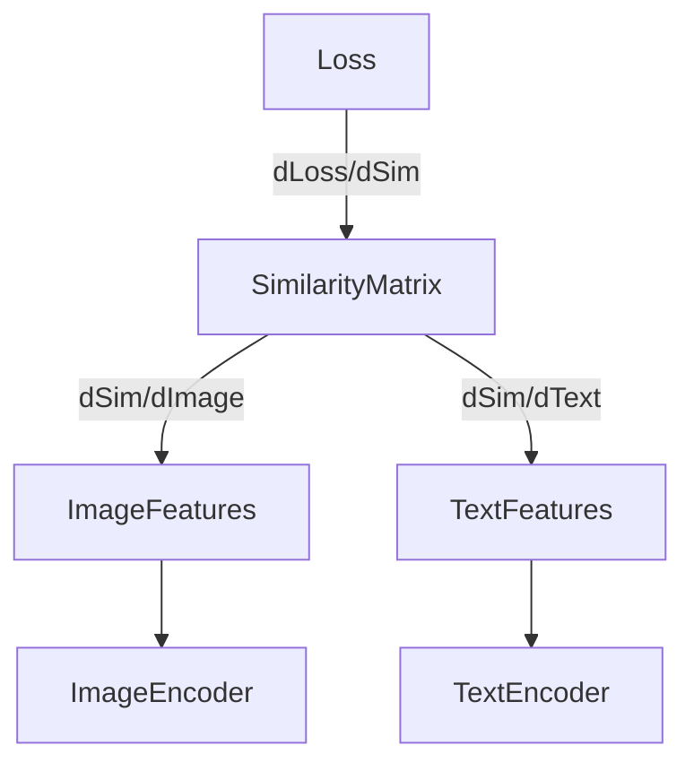

# CLIP (Contrastive Language-Image Pre-Training) 深度解析

> **一句话本质**：CLIP 通过对比学习（Contrastive Learning），强行把图像和文本拉到同一个向量空间，让它们学会"说同一种语言"。它把分类问题变成了"填空题"。

---

## 1. 核心机制 (Mechanism)

传统视觉模型（如 ResNet-50 训练在 ImageNet）只能输出固定的 1000 个类别概率。而 CLIP 不做分类，它做**匹配**。

它训练两个编码器：
1. **Image Encoder**：把图像变成向量
2. **Text Encoder**：把文本变成向量

如果一张图是"狗"，一段字是"a photo of a dog"，CLIP 的目标就是让这两个向量**尽可能相似**（点积最大），同时让它们与其他不匹配的图文向量**尽可能不相似**（点积最小）。


*(图1：CLIP 架构与 Tensor 流向图)*

---

## 2. Tensor 数据流 (Data Flow) - 训练阶段

假设一个 Batch Size $N=4$：

### Step 1: 输入 (Input)
- **Images**: `[4, 3, 224, 224]` (4张图, RGB, 224x224)
- **Texts**: `[4, 77]` (4段文本, Tokenize后长度77)

### Step 2: 编码 (Encoding)
- **Image Features**: 经过 ViT 提取特征 $
ightarrow$ `[4, 512]`
- **Text Features**: 经过 Transformer 提取特征 $
ightarrow$ `[4, 512]`

### Step 3: 投影与归一化 (Projection & Norm)
- **关键点**：必须做 L2 Normalization，把向量变成单位向量（模长为1）。这样点积（Dot Product）就等于余弦相似度（Cosine Similarity）。
- Output: $I_e \in \mathbb{R}^{4 	imes 512}, T_e \in \mathbb{R}^{4 	imes 512}$

### Step 4: 相似度矩阵 (Similarity Matrix)
- 计算 $I_e 	imes T_e^T$
- 维度变化：`[4, 512] @ [512, 4] -> [4, 4]`
- 结果是一个 $4 	imes 4$ 的矩阵，代表 Batch 里每张图和每段文本的相似度。

---

## 3. Loss 计算 (The "InfoNCE" Loss)

CLIP 的 Loss 是**对称的**对比损失。


*(图2：对比损失计算矩阵)*

### 直观解释
- **对角线**（蓝色格子）：正样本（配对的图文）。我们要最大化这里的值。
- **非对角线**（灰色格子）：负样本（不配对）。我们要最小化这里的值。

### 谁负责产生梯度？
Loss 函数（Cross Entropy）负责产生梯度。
- 如果对角线的值（logits）太小，梯度会回传，告诉 Encoder："你俩得更像一点！"
- 如果非对角线的值太大，梯度会回传，告诉 Encoder："你俩离远点！"

### 梯度怎么流回前面？

梯度是**双向流动**的，同时更新 Image Encoder 和 Text Encoder。

---

## 4. Zero-Shot 推理机制 (The Magic)

这是 CLIP 最强的地方：**它不需要重新训练就能做分类**。

### 原理：动态生成分类器权重
传统分类器的最后一层是固定的权重矩阵 $W \in \mathbb{R}^{D 	imes C}$。
CLIP 用**文本 Embedding** 替代了这个固定的 $W$。

### 举例：区分 3 种动物
假设我们要识别一张图，看看它是 `["dog", "cat", "car"]` 中的哪一个。

**Step 1: 构造 Prompt (Prompt Engineering)**
我们不直接送入单词 "dog"，而是构造成句子：
- `T1 = "a photo of a dog"`
- `T2 = "a photo of a cat"`
- `T3 = "a photo of a car"`

**Step 2: 生成分类器权重 (Synthesizing Weights)**
把这 3 句文本送入 **Text Encoder**：
```python
# 输入文本：[3, 77]
Text Encoder
    ↓
Text Features: [3, 512]
    ↓
L2 Normalize
    ↓
Weights W_text: [3, 512]  <-- 这是一个动态生成的分类器！
```

**Step 3: 图像推理 (Inference)**
把要识别的图片送入 **Image Encoder**：
```python
# 输入图片：[1, 3, 224, 224]
Image Encoder
    ↓
Image Feature I: [1, 512]
```

**Step 4: 计算概率**
```python
Logits = I @ W_text.T  # [1, 512] @ [512, 3] = [1, 3]
# 例如输出：[0.85, 0.12, 0.03]
# Softmax 后 -> "dog": 99%
```

### Prompt Ensemble (集成技巧)
为了让 Text Feature 更鲁棒，通常会用多个模板取平均：
- "a photo of a {label}."
- "a drawing of a {label}."
- "it is a {label}."
...
把这 80 个 Embedding 取平均 (Mean Pooling)，相当于你在描述一个东西时用了多角度特征，准确率通常能提升 3-5%。

---

## 5. 代码实现 (Code Implementation)

### 5.1 训练循环 (Training Loop)
```python
import torch
import torch.nn.functional as F
import numpy as np

# 1. 模拟数据 (Batch Size = 4, Dim = 512)
N, D = 4, 512
image_features = torch.randn(N, D, requires_grad=True) 
text_features = torch.randn(N, D, requires_grad=True)

# 2. L2 归一化 (Critical!)
I_e = F.normalize(image_features, p=2, dim=1)
T_e = F.normalize(text_features, p=2, dim=1)

# 3. 计算相似度矩阵
# Temperature scale usually learned, here fixed
logit_scale = np.exp(2.65)
logits = logit_scale * (I_e @ T_e.t()) # [4, 4]

# 4. 生成标签 (Ground Truth = Diagonal)
labels = torch.arange(N)

# 5. 计算 Loss (Symmetric Cross Entropy)
loss_i = F.cross_entropy(logits, labels)       # Image -> Text
loss_t = F.cross_entropy(logits.t(), labels)   # Text -> Image
total_loss = (loss_i + loss_t) / 2

# 6. 反向传播
total_loss.backward()
print(f"Gradients Flowing: {image_features.grad is not None}")
```

### 5.2 Zero-Shot 推理 (Inference)
```python
def zero_shot_classification(model, image, class_names):
    """
    model: CLIP model
    image: [1, 3, 224, 224]
    class_names: ["dog", "cat", "car"]
    """
    # 1. 构造 Prompts
    prompts = [f"a photo of a {name}" for name in class_names]
    
    # 2. 提取特征 (No Gradient)
    with torch.no_grad():
        image_features = model.encode_image(image)       # [1, 512]
        text_features = model.encode_text(prompts)       # [3, 512]
        
    # 3. 归一化
    image_features /= image_features.norm(dim=-1, keepdim=True)
    text_features /= text_features.norm(dim=-1, keepdim=True)
    
    # 4. 计算相似度 & 概率
    similarity = image_features @ text_features.T        # [1, 3]
    probs = similarity.softmax(dim=-1)
    
    return probs
```

---

## 6. 局限性与批判 (Critical Thinking)

费曼法则要求我们知道知识的边界。CLIP 不是万能的：

1.  **细粒度分类弱**：区分 "波音747" 和 "波音777"，或者不同种类的鸟，CLIP 很难。因为它预训练的数据（网页Alt Text）通常写得比较泛，很少有人写 "a photo of a Boeing 777-200ER"。
2.  **计数能力差**：问 "图里有几只猫？"，它经常瞎猜。因为它学的是语义共现（"猫"这个词和图片一起出现），而不是目标检测（Object Detection）。
3.  **空间关系弱**：问 "猫在车顶上吗？"，它可能只看到 "猫" 和 "车"，分不清谁在谁上面。
4.  **文字识别 (OCR) 弱**：虽然它能认出 Apple 的 Logo，但如果你手写一个 "Apple" 的字条贴在梨上，它可能会被误导。
