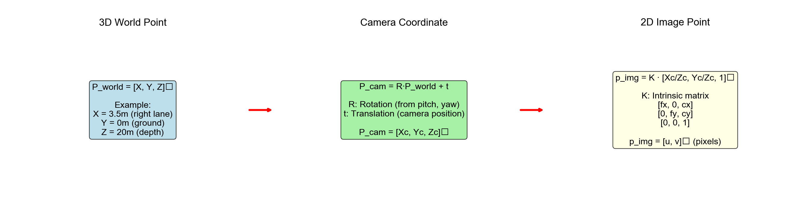
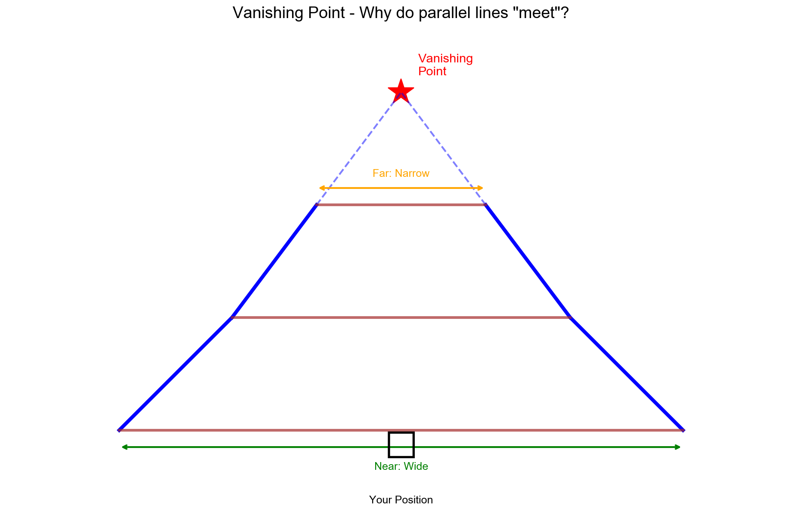
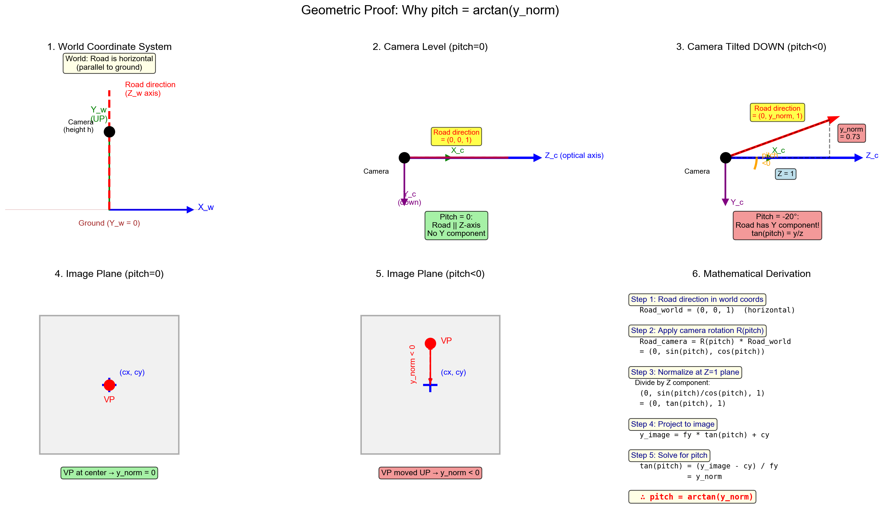
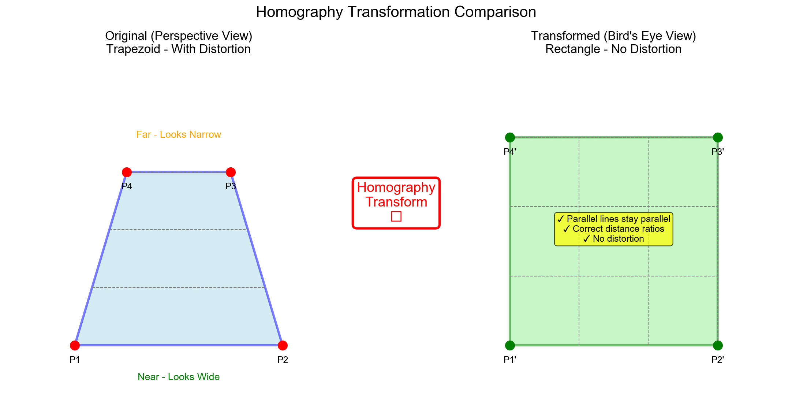
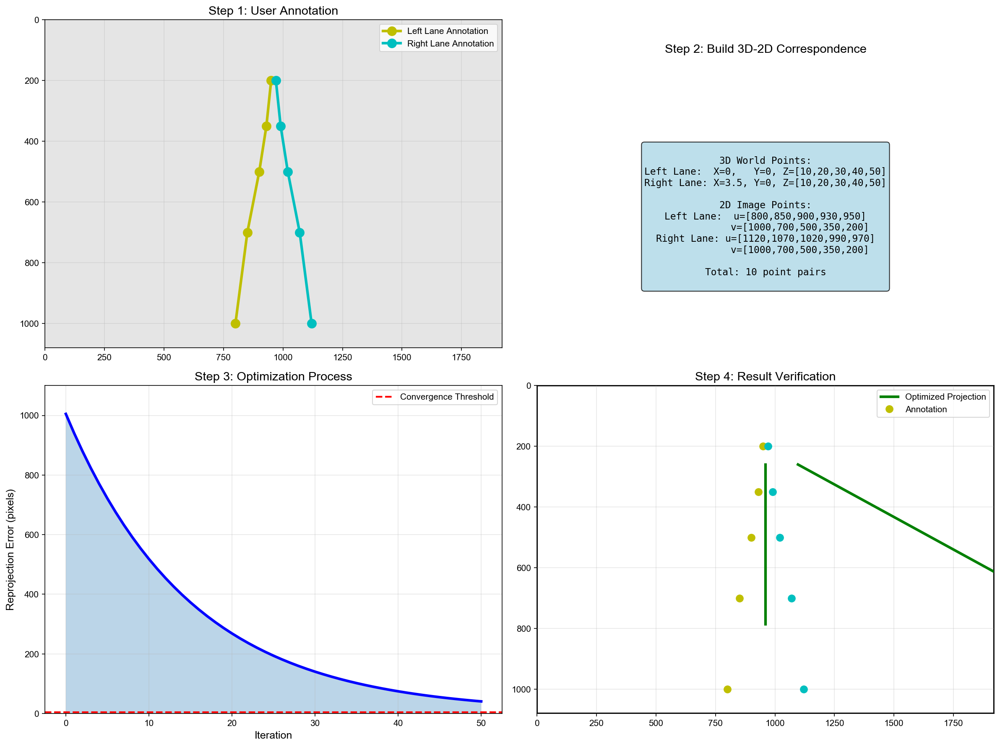

> **从输入图像到输出鸟瞰图的完整实现** - 适合所有水平的学习者

<!-- more -->

## 🎯 教程简介

本教程将带你**从零开始**学习如何把一张斜着拍摄的图像（比如路面照片）转换成从正上方看的俯视图（鸟瞰图）。

### 你将学到什么？

```infographic
infographic list-row-simple-horizontal-arrow
data
  title 完整学习路径
  items
    - label 输入图像
      desc 斜着看的照片
    - label 理解透视
      desc 坐标系统
    - label 计算变换
      desc 单应性矩阵
    - label 实现代码
      desc Python+OpenCV
    - label 输出俯视图
      desc 鸟瞰图
```

---

## 📚 第一章：基础概念

### 1.1 三种坐标系统

在图像处理中，我们需要理解三种坐标系统的转换关系：


```infographic
infographic list-grid-badge-card
data
  title 三种坐标系
  items
    - label 世界坐标系
      desc 固定在地面，单位：米
      icon mdi:earth
    - label 相机坐标系
      desc 跟随相机移动旋转
      icon mdi:camera
    - label 图像坐标系
      desc 2D像素平面
      icon mdi:image
```

#### 世界坐标系 (World Coordinates)

**生活例子**：就像地图的经纬度，固定不变的参考系。

```python
# 世界坐标中的一个点（3米，5米，0米）
point_world = np.array([3.0, 5.0, 0.0])  # [X, Y, Z]
```

**特点：**
- 原点：通常选在地面某个固定位置
- X轴：向右（东方）
- Y轴：向前（北方）
- Z轴：向上（天空）

---

#### 相机坐标系 (Camera Coordinates)


**核心规则：**
- 原点：在相机镜头中心
- Z轴：镜头朝向（光轴方向）
- X轴：相机向右
- Y轴：相机向下（⚠️ 注意：向下！）

**为什么Y轴向下？**
```
传统原因：
┌─────────┐
│ (0,0)   │  ← 图像左上角是(0,0)
│    ↓ Y  │
│  → X    │
└─────────┘
```

---

#### 图像坐标系 (Image Coordinates)

**就是我们看到的照片像素坐标：**

```python
# 图像中的一个像素点
pixel = (320, 240)  # (u, v) 像素坐标
```

**单位**：像素 (pixel)

---

### 1.2 透视投影原理


**小孔成像模型**是相机的数学抽象：

```
3D世界 ──────> 小孔 ──────> 2D图像
(X,Y,Z)        相机        (u,v)
```

**投影过程：**



**数学公式：**

$$
\begin{bmatrix} u \\ v \\ 1 \end{bmatrix} = K \begin{bmatrix} R | t \end{bmatrix} \begin{bmatrix} X \\ Y \\ Z \\ 1 \end{bmatrix}
$$

其中：
- **K**：相机内参矩阵（焦距、主点）
- **R**：旋转矩阵（相机朝向）
- **t**：平移向量（相机位置）

---

### 1.3 透视效果


**为什么远处的物体看起来小？**

```
近处的车 ━━━━  看起来大
中间的车 ━━━   看起来中等
远处的车 ━━    看起来小
```

这就是**透视投影**的效果！

---

## 📐 第二章：消失点理论

### 2.1 什么是消失点？



**生活例子**：站在铁轨中间拍照，两条平行的铁轨在远处看起来会"相交"。

**定义**：
> 现实中平行的线，在图像中延伸后相交的点，就是**消失点** (Vanishing Point)。

---

### 2.2 消失点的计算

**原理**：两条平行线的交点

```python
def compute_vanishing_point(line1_pts, line2_pts):
    """
    计算两条平行线的消失点
    
    参数：
        line1_pts: 直线1的两个点 [[x1,y1], [x2,y2]]
        line2_pts: 直线2的两个点 [[x3,y3], [x4,y4]]
    
    返回：
        vp: 消失点坐标 [vx, vy]
    """
    # 转为齐次坐标
    p1 = np.array([line1_pts[0][0], line1_pts[0][1], 1])
    p2 = np.array([line1_pts[1][0], line1_pts[1][1], 1])
    p3 = np.array([line2_pts[0][0], line2_pts[0][1], 1])
    p4 = np.array([line2_pts[1][0], line2_pts[1][1], 1])
    
    # 计算直线（叉乘）
    L1 = np.cross(p1, p2)
    L2 = np.cross(p3, p4)
    
    # 计算交点（叉乘）
    vp_homo = np.cross(L1, L2)
    
    # 归一化
    vp = vp_homo[:2] / vp_homo[2]
    
    return vp
```

---

### 2.3 从消失点到相机参数


**核心思想**：消失点的位置反映了相机的朝向！

```python
def estimate_camera_params(vp, img_shape, cx=None, cy=None):
    """
    从消失点估计相机参数
    
    参数：
        vp: 消失点坐标 [vx, vy]
        img_shape: 图像大小 (height, width)
        cx, cy: 主点坐标（可选）
    
    返回：
        focal: 估计的焦距
        yaw: yaw角度（度）
        pitch: pitch角度（度）
    """
    h, w = img_shape[:2]
    
    # 主点（默认图像中心）
    if cx is None:
        cx = w / 2
    if cy is None:
        cy = h / 2
    
    vx, vy = vp
    
    # 计算偏移
    dx = vx - cx
    dy = vy - cy
    
    # 估计焦距
    focal = np.sqrt(w**2 + h**2)
    
    # 计算角度
    yaw = np.arctan2(dx, focal)
    pitch = np.arctan2(dy, focal)
    
    # 转为角度
    yaw_deg = np.degrees(yaw)
    pitch_deg = np.degrees(pitch)
    
    return focal, yaw_deg, pitch_deg
```

---

### 2.4 几何证明




**核心公式：**

$$
\text{yaw} = \arctan\left(\frac{v_x - c_x}{f}\right)
$$

$$
\text{pitch} = \arctan\left(\frac{v_y - c_y}{f}\right)
$$

---

## 🔄 第三章：单应性变换

### 3.1 什么是单应性？

**生活例子**：

```
相机视角（透视图）：
     |  |      近处的条纹 - 看起来很宽
     |   |
     |    |    
     |     |   
     |      |  远处的条纹 - 看起来很窄

鸟瞰视角：
  ||||||||     所有条纹 - 宽度一样
  ||||||||
  ||||||||
```

**单应性变换**就是把第一种视角转换成第二种视角的数学方法！



---

### 3.2 单应性矩阵

**数学定义：**

$$
\begin{bmatrix} x' \\ y' \\ 1 \end{bmatrix} = H \begin{bmatrix} x \\ y \\ 1 \end{bmatrix}
$$

其中 **H** 是一个 **3×3 的矩阵**：

```
     ┌                    ┐
     │  h11   h12   h13  │
H =  │  h21   h22   h23  │
     │  h31   h32   h33  │
     └                    ┘
```

**特点**：
- 9个数字，但只有8个自由度
- 可以表示旋转、缩放、平移、透视变换

---

### 3.3 DLT算法求解H矩阵

**核心思想**：用4对点构建方程组，用SVD求解。

```python
def normalize_points(points):
    """
    归一化点集（提高数值稳定性）
    """
    # 计算中心点
    centroid = np.mean(points, axis=0)
    
    # 平移到原点
    centered = points - centroid
    
    # 计算平均距离
    avg_dist = np.mean(np.sqrt(np.sum(centered**2, axis=1)))
    
    # 缩放因子
    scale = np.sqrt(2) / (avg_dist + 1e-8)
    
    # 构建归一化矩阵
    T = np.array([
        [scale, 0, -scale * centroid[0]],
        [0, scale, -scale * centroid[1]],
        [0, 0, 1]
    ])
    
    return T

def compute_homography_dlt(src_pts, dst_pts):
    """
    使用DLT算法计算单应性矩阵
    
    参数：
        src_pts: 源平面点 (N×2)
        dst_pts: 目标平面点 (N×2)
    
    返回：
        H: 3×3 单应性矩阵
    """
    assert len(src_pts) >= 4, "至少需要4个点！"
    
    # 归一化（提高数值稳定性）
    T_src = normalize_points(src_pts)
    T_dst = normalize_points(dst_pts)
    
    # 归一化点
    src_homo = np.column_stack([src_pts, np.ones(len(src_pts))])
    dst_homo = np.column_stack([dst_pts, np.ones(len(dst_pts))])
    
    src_norm = (T_src @ src_homo.T).T
    dst_norm = (T_dst @ dst_homo.T).T
    
    src_norm_2d = src_norm[:, :2] / src_norm[:, 2:3]
    dst_norm_2d = dst_norm[:, :2] / dst_norm[:, 2:3]
    
    # 构建矩阵A
    A = []
    for i in range(len(src_norm_2d)):
        x1, y1 = src_norm_2d[i]
        x2, y2 = dst_norm_2d[i]
        
        # 两个约束方程
        A.append([
            -x1, -y1, -1, 0, 0, 0, x2*x1, x2*y1, x2
        ])
        A.append([
            0, 0, 0, -x1, -y1, -1, y2*x1, y2*y1, y2
        ])
    
    A = np.array(A)
    
    # SVD分解
    U, S, Vt = np.linalg.svd(A)
    
    # 最小奇异值对应的向量
    h = Vt[-1, :]
    
    # 重构H矩阵
    H_norm = h.reshape(3, 3)
    
    # 反归一化
    H = np.linalg.inv(T_dst) @ H_norm @ T_src
    
    # 归一化（使h33=1）
    H = H / H[2, 2]
    
    return H
```

---

### 3.4 优化过程



**步骤解析：**

```infographic
infographic sequence-steps-simple
data
  title DLT算法流程
  items
    - label 归一化点
      desc 提高数值稳定性
    - label 构建方程组
      desc Ah = 0
    - label SVD分解
      desc 求最小奇异值
    - label 提取H矩阵
      desc 重构3×3矩阵
    - label 反归一化
      desc 恢复原始尺度
```

---

## 💻 第四章：完整代码实现

### 4.1 环境搭建

**Python环境要求：**

```bash
# Python版本
Python 3.7+

# 核心库
numpy>=1.19.0
opencv-python>=4.5.0
matplotlib>=3.3.0
```

**安装步骤：**

```bash
# 创建虚拟环境（推荐）
python -m venv cv_env

# 激活虚拟环境
# Mac/Linux:
source cv_env/bin/activate
# Windows:
cv_env\Scripts\activate

# 安装依赖
pip install numpy opencv-python matplotlib

# 验证安装
python -c "import cv2; print(cv2.__version__)"
```

---

### 4.2 项目结构

```
bird_eye_view_project/
├── input/                  # 输入图像
│   └── dashcam.jpg
├── output/                 # 输出结果
│   ├── marked.jpg
│   ├── bird_view.jpg
│   └── result.jpg
├── main.py                 # 主程序
└── requirements.txt        # 依赖列表
```

---

### 4.3 交互式鸟瞰图生成器

```python
"""
从图像到俯视图：完整实现
功能：交互式选点 → 计算单应性矩阵 → 生成鸟瞰图
"""

import cv2
import numpy as np
import matplotlib.pyplot as plt
from pathlib import Path

class InteractiveBirdEyeView:
    """
    交互式鸟瞰图生成器
    
    使用方法：
    1. 点击图像选择4个点
    2. 自动计算单应性矩阵
    3. 生成鸟瞰图
    """
    
    def __init__(self, img):
        """
        初始化
        
        参数：
            img: 输入图像（numpy数组）
        """
        self.img = img.copy()
        self.display_img = img.copy()
        self.points = []
        self.max_points = 4
        self.window_name = '选择4个点（按顺序：左下→右下→右上→左上）'
        
    def mouse_callback(self, event, x, y, flags, param):
        """鼠标回调函数"""
        if event == cv2.EVENT_LBUTTONDOWN:
            if len(self.points) < self.max_points:
                self.points.append([x, y])
                print(f"点 {len(self.points)}: ({x}, {y})")
                self.draw_points()
                
                # 如果已经选择了4个点，自动处理
                if len(self.points) == self.max_points:
                    print("\n✅ 已选择4个点，计算中...")
                    cv2.waitKey(1000)
                    cv2.destroyWindow(self.window_name)
    
    def draw_points(self):
        """绘制已选择的点"""
        self.display_img = self.img.copy()
        
        for i, pt in enumerate(self.points):
            # 绘制圆点
            cv2.circle(self.display_img, tuple(pt), 8, (0, 255, 0), -1)
            # 绘制序号
            cv2.putText(
                self.display_img, 
                str(i+1), 
                (pt[0]+15, pt[1]), 
                cv2.FONT_HERSHEY_SIMPLEX, 
                0.8, 
                (0, 0, 255), 

```python
            )
        # 绘制连线
        if len(self.points) > 1:
            pts = np.array(self.points, np.int32)
            cv2.polylines(
                self.display_img,
                [pts],
                len(self.points) == 4,
                (255, 0, 0),
            )
        # 显示提示信息
        info = f"已选择 {len(self.points)}/{self.max_points} 个点"
        cv2.putText(
            self.display_img,
            info,
            (10, 30),
            cv2.FONT_HERSHEY_SIMPLEX,
            1,
            (255, 255, 0),
        )
        cv2.imshow(self.window_name, self.display_img)
    def select_points(self):
        """
        交互式选择点
        返回：
            points: 4×2 numpy数组，或None（如果取消）
        """
        cv2.namedWindow(self.window_name, cv2.WINDOW_NORMAL)
        cv2.setMouseCallback(self.window_name, self.mouse_callback)
        print("\n" + "="*60)
        print("📌 请在图像上依次点击4个点")
        print("   顺序：左下 → 右下 → 右上 → 左上")
        print("   提示：选择路面上的矩形区域")
        print("   按ESC可以取消")
        print("="*60 + "\n")
        self.draw_points()
        while len(self.points) < self.max_points:
            key = cv2.waitKey(1) & 0xFF
            if key == 27:  # ESC
                print("❌ 已取消")
                cv2.destroyAllWindows()
                return None
        return np.array(self.points, dtype=np.float32)
    def compute_bird_view(self, bird_w=400, bird_h=600, margin=50):
        """
        计算并显示鸟瞰图
        参数：
            bird_w: 鸟瞰图宽度（像素）
            bird_h: 鸟瞰图高度（像素）
            margin: 边距（像素）
        返回：
            result: 包含原图和鸟瞰图的字典
        """
        # 选择点
        src_pts = self.select_points()
        if src_pts is None:
            return None
        print("\n🔄 处理中...")
        # 定义目标点（俯视图中的矩形）
        dst_pts = np.array([
            [margin, bird_h - margin],
            [bird_w - margin, bird_h - margin],
            [bird_w - margin, margin],
            [margin, margin]
        ], dtype=np.float32)
        # 计算单应性矩阵
        H = compute_homography_dlt(src_pts, dst_pts)
        print("\n📐 单应性矩阵 H:")
        print(H)
        # 变换图像
        bird_view = cv2.warpPerspective(
            self.img,
            H,
            (bird_w, bird_h),
            flags=cv2.INTER_LINEAR
        )
        # 在原图上绘制选择的区域
        marked_img = self.img.copy()
        pts = src_pts.astype(np.int32).reshape((-1, 1, 2))
        cv2.polylines(marked_img, [pts], True, (0, 255, 0), 3)
        for i, pt in enumerate(src_pts):
            cv2.circle(marked_img, tuple(pt.astype(int)), 10, (0, 255, 0), -1)
            cv2.putText(
                marked_img,
                str(i+1),
                tuple(pt.astype(int)),
                cv2.FONT_HERSHEY_SIMPLEX,
                1,
                (0, 0, 255),
            )
        # 返回结果
        result = {
            'original': self.img,
            'marked': marked_img,
            'bird_view': bird_view,
            'homography': H,
            'src_points': src_pts,
            'dst_points': dst_pts
        }
        print("\n✅ 处理完成！")
        return result
def visualize_results(result, save_path=None):
    """
    可视化结果
    参数：
        result: compute_bird_view返回的结果字典
        save_path: 保存路径（可选）
    """
    if result is None:
        print("没有结果可显示")
        return
    # 创建对比图
    h1, w1 = result['marked'].shape[:2]
    h2, w2 = result['bird_view'].shape[:2]
    # 调整大小使高度一致
    target_h = 400
    scale1 = target_h / h1
    scale2 = target_h / h2
    img1_resized = cv2.resize(result['marked'], (int(w1*scale1), target_h))
    img2_resized = cv2.resize(result['bird_view'], (int(w2*scale2), target_h))
    # 水平拼接
    combined = np.hstack([img1_resized, img2_resized])
    # 添加标题
    cv2.putText(
        combined,
        'Original (Perspective)',
        (10, 30),
        cv2.FONT_HERSHEY_SIMPLEX,
        1,
        (255, 255, 0),
    )
    cv2.putText(
        combined,
        'Bird Eye View (Top-down)',
        (int(w1*scale1) + 10, 30),
        cv2.FONT_HERSHEY_SIMPLEX,
        1,
        (255, 255, 0),
    )
    # 显示
    cv2.namedWindow('Result', cv2.WINDOW_NORMAL)
    cv2.imshow('Result', combined)
    # 保存
    if save_path:
        cv2.imwrite(str(save_path), combined)
        print(f"\n💾 结果已保存到: {save_path}")
    print("\n按任意键关闭...")
    cv2.waitKey(0)
    cv2.destroyAllWindows()
def main():
    """
    主函数
    """
    print("\n" + "="*60)
    print("🚗 从图像到俯视图：完整实现")
    print("="*60)
    # 1. 读取图像
    img_path = input("\n请输入图像路径（或按回车使用默认）: ").strip()
    if not img_path:
        img_path = "input/dashcam.jpg"
    print(f"\n📂 读取图像: {img_path}")
    img = cv2.imread(img_path)
    if img is None:
        print(f"❌ 无法读取图像: {img_path}")
        return
    print(f"✅ 图像大小: {img.shape[1]} × {img.shape[0]}")
    # 2. 创建交互式界面
    bev = InteractiveBirdEyeView(img)
    # 3. 计算鸟瞰图
    result = bev.compute_bird_view(
        bird_w=400,
        bird_h=600,
        margin=50
    )
    if result is None:
        return
    # 4. 显示结果
    visualize_results(result, save_path="output/result.jpg")
    # 5. 保存各个结果
    cv2.imwrite("output/marked.jpg", result['marked'])
    cv2.imwrite("output/bird_view.jpg", result['bird_view'])
    print("\n📁 所有文件已保存到 output/ 目录")
    print("\n✨ 完成！")
if __name__ == "__main__":
    main()
```
---
### 4.4 运行效果
**运行步骤：**
```bash
# 1. 运行程序
python main.py
# 2. 输入图像路径（或使用默认）
请输入图像路径（或按回车使用默认）:
# 3. 在弹出的窗口中点击4个点
📌 请在图像上依次点击4个点
   顺序：左下 → 右下 → 右上 → 左上
# 4. 查看结果
✅ 处理完成！
💾 结果已保存到: output/result.jpg
```
**效果展示：**
```
输入图像（斜视角）          输出图像（俯视图）
     ╱╲                        ┌──────┐
    ╱  ╲       →               │      │
   ╱    ╲      变换             │      │
  ╱______╲                      └──────┘
 梯形效果                        矩形效果
```
---
## 🐛 第五章：调试与优化
### 5.1 常见问题
#### 问题1：图像变形严重
**原因**：点选择不合理
**解决方案**：
```python
def check_points_distribution(pts):
    """检查点的分布"""
    std_x = np.std(pts[:, 0])
    std_y = np.std(pts[:, 1])
    if std_x < 50 or std_y < 50:
        print("⚠️  警告：点分布过于集中！")
        print(f"   X方向标准差: {std_x:.1f}")
        print(f"   Y方向标准差: {std_y:.1f}")
        print("   建议：选择更分散的点")
        return False
    return True
```
---
#### 问题2：鸟瞰图有黑边
**原因**：输出图像范围设置不当
**解决方案**：
```python
def compute_output_size(img, H, src_pts):
    """自动计算输出图像大小"""
    h, w = img.shape[:2]
    # 变换图像的四个角点
    corners = np.array([
        [0, 0], [w, 0], [w, h], [0, h]
    ], dtype=np.float32)
    # 应用H变换
    corners_homo = np.column_stack([corners, np.ones(4)])
    transformed = (H @ corners_homo.T).T
    transformed = transformed[:, :2] / transformed[:, 2:3]
    # 计算边界
    min_x = np.min(transformed[:, 0])
    max_x = np.max(transformed[:, 0])
    min_y = np.min(transformed[:, 1])
    max_y = np.max(transformed[:, 1])
    out_w = int(max_x - min_x)
    out_h = int(max_y - min_y)
    return out_w, out_h
```
---
#### 问题3：运行速度慢
**解决方案**：
```python
# 使用更快的插值方法
result = cv2.warpPerspective(
    img,
    H,
    (out_w, out_h),
    flags=cv2.INTER_LINEAR  # 双线性插值（快）
    # flags=cv2.INTER_CUBIC  # 双三次插值（慢但更好）
)
```
---
### 5.2 性能优化
```infographic
infographic list-grid-badge-card
data
  title 优化技巧
  items
    - label 向量化计算
      desc 避免Python循环
      icon mdi:speedometer
    - label GPU加速
      desc 使用cv2.cuda模块
      icon mdi:chip
    - label 多线程
      desc 并行处理多张图像
      icon mdi:lan
    - label 缓存结果
      desc 避免重复计算
      icon mdi:cached
```
---
## 🚀 第六章：进阶应用
### 6.1 视频流处理
```python
def process_video(video_path, H):
    """对视频应用鸟瞰变换"""
    cap = cv2.VideoCapture(video_path)
    # 获取视频参数
    fps = int(cap.get(cv2.CAP_PROP_FPS))
    w = int(cap.get(cv2.CAP_PROP_FRAME_WIDTH))
    h = int(cap.get(cv2.CAP_PROP_FRAME_HEIGHT))
    # 创建输出视频
    fourcc = cv2.VideoWriter_fourcc(*'mp4v')
    out = cv2.VideoWriter('output.mp4', fourcc, fps, (400, 600))
    print(f"处理视频：{fps} FPS, {w}x{h}")
    frame_count = 0
    while cap.isOpened():
        ret, frame = cap.read()
        if not ret:
            break
        # 应用变换
        bird_view = cv2.warpPerspective(frame, H, (400, 600))
        # 写入输出
        out.write(bird_view)
        frame_count += 1
        if frame_count % 30 == 0:
            print(f"已处理 {frame_count} 帧")
    cap.release()
    out.release()
    cv2.destroyAllWindows()
    print(f"✅ 完成！共处理 {frame_count} 帧")
```
---
### 6.2 实时相机标定
```python
def realtime_calibration():
    """实时相机标定和鸟瞰图生成"""
    cap = cv2.VideoCapture(0)
    H = None
    calibrated = False
    print("按 'c' 进入标定模式")
    print("按 'q' 退出")
    while True:
        ret, frame = cap.read()
        if not ret:
            break
        if calibrated and H is not None:
            # 应用变换
            bird_view = cv2.warpPerspective(frame, H, (400, 600))
            # 并排显示
            display = np.hstack([
                cv2.resize(frame, (400, 300)),
                cv2.resize(bird_view, (400, 300))
            ])
            cv2.imshow('Camera | Bird View', display)
        else:
            cv2.imshow('Camera', frame)
        key = cv2.waitKey(1) & 0xFF
        if key == ord('c'):
            print("\n开始标定...")
            bev = InteractiveBirdEyeView(frame)
            result = bev.compute_bird_view()
            if result is not None:
                H = result['homography']
                calibrated = True
                print("✅ 标定完成！")
        elif key == ord('q'):
            break
    cap.release()
    cv2.destroyAllWindows()
```
---
## 📊 总结
### 学习成果
```infographic
infographic list-column-done-list
data
  title 你已经掌握
  items
    - label 理解透视投影原理
      desc 3D到2D的转换
    - label 计算消失点
      desc 从平行线找交点
    - label 估计相机参数
      desc 焦距和角度
    - label 单应性变换
      desc DLT算法
    - label 完整代码实现
      desc Python+OpenCV
```
---
### 核心知识点
| 概念 | 公式/方法 | 应用 |
```

| 透视投影 | `u = K[R\|t]X` | 3D→2D转换 |
| 消失点 | 平行线交点 | 估计相机朝向 |
| 单应性 | `x' = Hx` | 平面变换 |
| DLT算法 | SVD求解 | 计算H矩阵 |

---

### 后续学习方向

```infographic
infographic hierarchy-tree-curved-line-rounded-rect-node
data
  title 进阶路径
  items
    - label 深度学习
      children:
        - label 神经网络检测关键点
        - label 端到端视角转换
    - label 3D重建
      children:
        - label 多视角3D恢复
        - label SLAM技术
    - label 实时系统
      children:
        - label GPU加速
        - label 嵌入式部署
```

---

## 🎉 结语

你已经掌握了从图像到俯视图转换的完整知识和技能！

**记住：**
- 📚 理论是基础
- 💻 代码是实践
- 🐛 调试是成长
- 🚀 应用是目标

**继续探索，不断进步！** ✨

---

## 📚 参考资料

### 学习资源

- [OpenCV官方文档](https://docs.opencv.org/)
- [Multiple View Geometry (Hartley & Zisserman)](https://www.robots.ox.ac.uk/~vgg/hzbook/)
- [计算机视觉基础](https://szeliski.org/Book/)

### 相关论文

- Homography Estimation: A Review
- Camera Calibration Methods
- Perspective Transformation in Computer Vision

---

**版本信息：**
- 版本：1.0.0
- 创建日期：2026-01-19
- 编程语言：Python 3.7+
- 主要依赖：OpenCV, NumPy

---

**祝你学习愉快！如有任何问题，欢迎交流讨论。** 🎉
