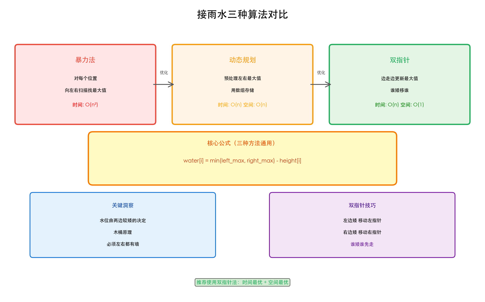
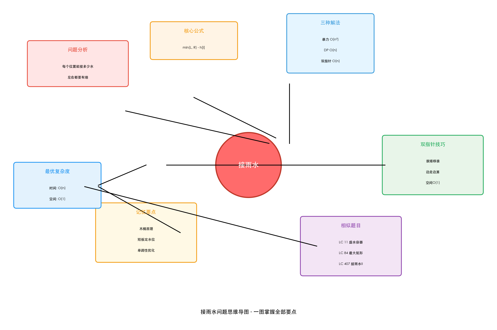
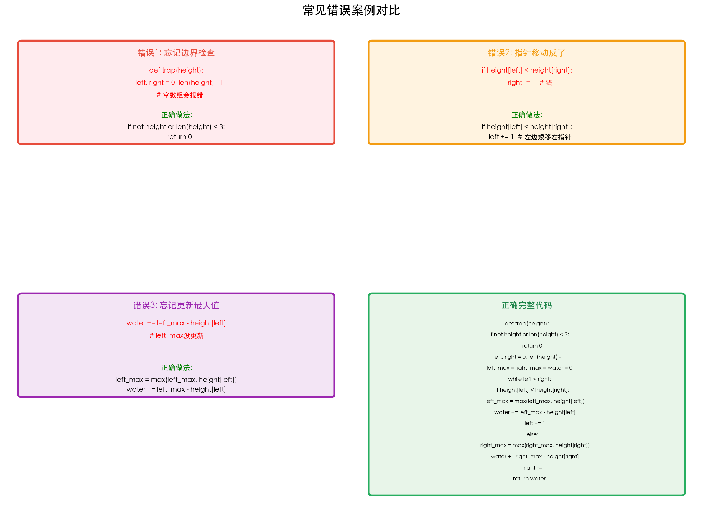
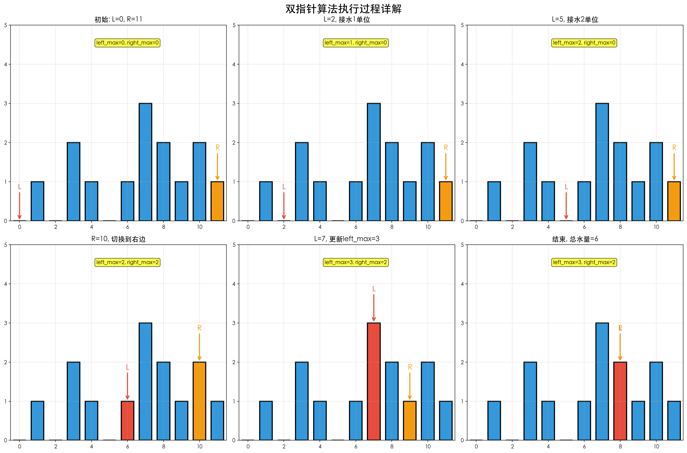
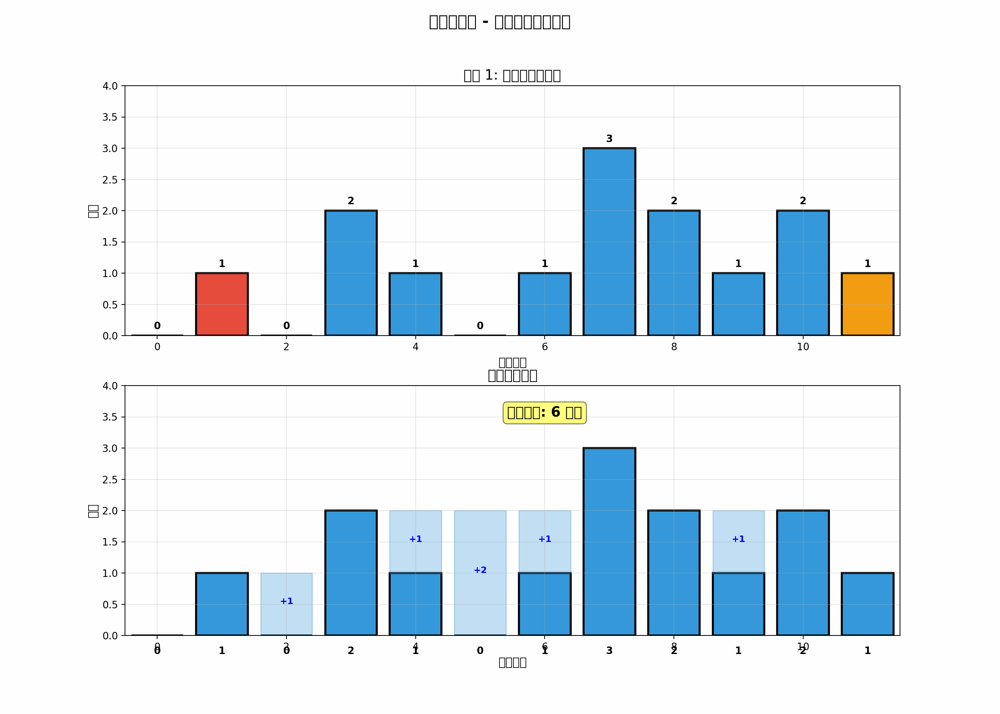
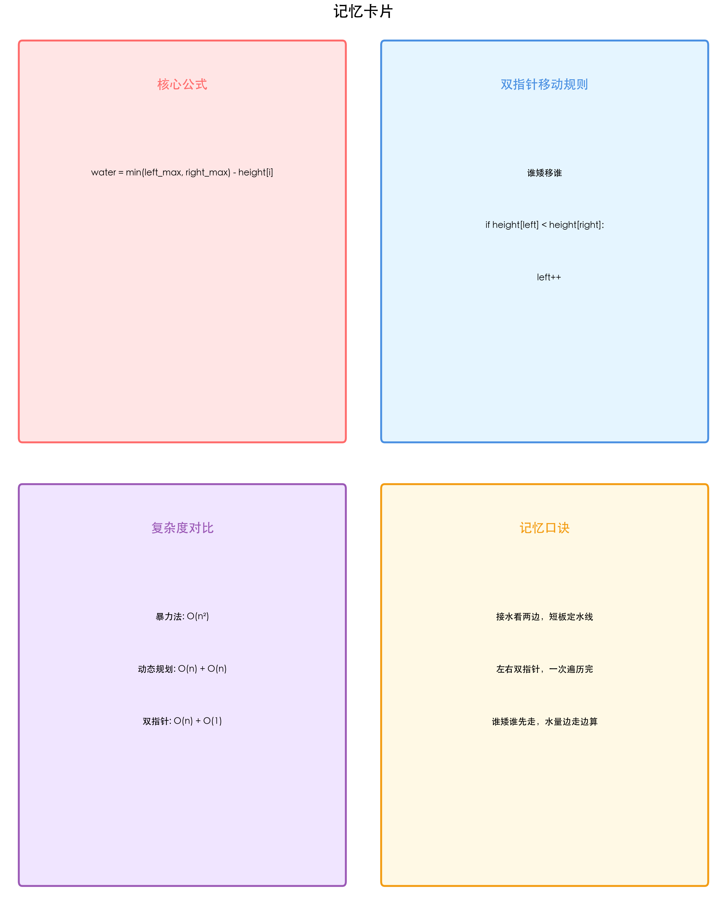
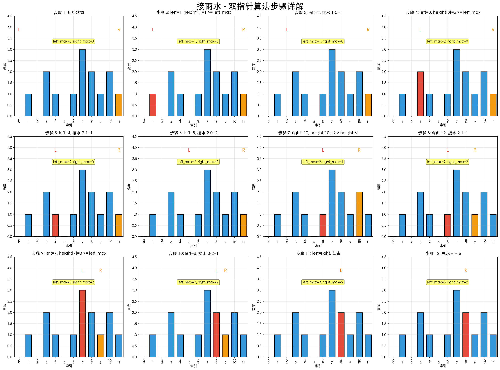

# 🌧️ 接雨水问题 - 完全学习指南

> **LeetCode 42. Trapping Rain Water (Hard)**
>
> 一份让小学生都能看懂的算法学习文档

---

## 📚 目录

1. [问题理解](#问题理解)
2. [拿到题目后的分析步骤](#拿到题目后的分析步骤)
3. [解题思路详解](#解题思路详解)
4. [算法实现与代码](#算法实现与代码)
5. [复杂度分析](#复杂度分析)
6. [相似题目总结](#相似题目总结)
7. [通用解题模板](#通用解题模板)
8. [费曼学习卡片](#费曼学习卡片)
9. [记忆口诀](#记忆口诀)

---

## 🎯 问题理解

### 题目描述

给定 n 个非负整数表示每个宽度为 1 的柱子的高度图，计算按此排列的柱子，下雨之后能接多少雨水。

### 用小学生的话说

想象你有一排高低不同的积木块，下雨了，雨水会积在积木块之间的凹陷处。问题是：**这些凹陷处总共能装多少水？**

### 示例图解

```
输入: height = [0,1,0,2,1,0,1,3,2,1,2,1]

下雨前的柱子:
    █
█   █ █   █
█ █ █ █ █ ███
█ █ █ █ █ ███
0 1 0 2 1 0 1 3 2 1 2 1

下雨后(蓝色是水):
    █
█ ≈≈█≈█≈≈≈█
█≈█≈█≈█≈███
█≈█≈█≈█≈███
0 1 0 2 1 0 1 3 2 1 2 1

答案: 6 (6个单位的水)
```

---

## 🔍 拿到题目后的分析步骤

### 第一步：理解问题本质

**核心问题：** 每个位置能接多少水？

**关键观察：**

- 一个位置能接水的前提是：**左右两边都有比它高的柱子**
- 就像一个杯子，必须两边有壁才能装水

### 第二步：找规律

让我们看位置 i 能接多少水：

```
左边最高: left_max    当前位置: height[i]    右边最高: right_max
    |                      |                      |
    ↓                      ↓                      ↓
  █████                   █                    █████
  █████                   █                    █████
  █████                  ███                   █████
```

**关键公式：**

```
位置 i 的接水量 = min(left_max, right_max) - height[i]
```

**为什么是 min？**

- 想象一个木桶，水位由最短的那块木板决定
- 左边再高，右边矮，水也会从右边流走
- 所以取两边的**较小值**

### 第三步：思考解法

现在我们知道了公式，问题变成：**如何高效地找到每个位置的 left_max 和 right_max？**

有三种思路：

1. **暴力法**：对每个位置，向左右扫描找最大值 → O(n²)
2. **动态规划**：预先计算所有位置的 left_max 和 right_max → O(n)
3. **双指针**：一次遍历同时维护左右最大值 → O(n)，空间 O(1)

---

## 💡 解题思路详解

### 方法一：动态规划（最容易理解）

**核心思想：** 用两个数组提前存好每个位置的左右最大值

#### 步骤拆解

**步骤1：从左到右扫描，记录每个位置左边的最大值**

```
height:    [0, 1, 0, 2, 1, 0, 1, 3, 2, 1, 2, 1]
left_max:  [0, 0, 1, 1, 2, 2, 2, 2, 3, 3, 3, 3]
           ↑
           第0个位置左边没有柱子，所以是0
                ↑
                第2个位置左边最高是1
```

**步骤2：从右到左扫描，记录每个位置右边的最大值**

```
height:     [0, 1, 0, 2, 1, 0, 1, 3, 2, 1, 2, 1]
right_max:  [3, 3, 3, 3, 3, 3, 3, 2, 2, 2, 1, 0]
                                              ↑
                                              最后一个位置右边没有柱子
```

**步骤3：计算每个位置的接水量**

```
位置 i=2:
  left_max[2] = 1
  right_max[2] = 3
  height[2] = 0
  水量 = min(1, 3) - 0 = 1
```

#### 动态规划代码

```python
def trap_dp(height):
    if not height:
        return 0

    n = len(height)
    left_max = [0] * n
    right_max = [0] * n

    # 计算left_max
    for i in range(1, n):
        left_max[i] = max(left_max[i-1], height[i-1])

    # 计算right_max
    for i in range(n-2, -1, -1):
        right_max[i] = max(right_max[i+1], height[i+1])

    # 计算总水量
    water = 0
    for i in range(n):
        min_height = min(left_max[i], right_max[i])
        if min_height > height[i]:
            water += min_height - height[i]

    return water
```

**时间复杂度：** O(n) - 三次遍历
**空间复杂度：** O(n) - 两个数组

---

### 方法二：双指针（最优解）

**核心思想：** 不需要提前知道所有的最大值，边走边更新

#### 为什么双指针可行？

关键洞察：

- 如果 `height[left] < height[right]`，那么左边的水量只取决于 `left_max`
- 因为右边肯定有更高的柱子（至少 `height[right]` 就比左边高）
- 反之亦然

**形象比喻：**

```
想象你站在山谷里：
- 如果左边的山比右边矮，你只需要关心左边的山有多高
- 因为右边的山更高，水不会从右边流走
```

#### 双指针步骤

```
初始状态:
left = 0, right = 11
left_max = 0, right_max = 0

[0, 1, 0, 2, 1, 0, 1, 3, 2, 1, 2, 1]
 ↑                                ↑
left                            right

步骤1: height[0]=0 < height[11]=1
  → 处理左边
  → left_max = max(0, 0) = 0
  → 水量 = 0 - 0 = 0
  → left++

步骤2: height[1]=1 = height[11]=1
  → 处理左边（相等时处理哪边都行）
  → left_max = max(0, 1) = 1
  → 水量 = 1 - 1 = 0
  → left++

步骤3: height[2]=0 < height[11]=1
  → 处理左边
  → left_max = 1（不变）
  → 水量 = 1 - 0 = 1 ✓
  → left++

...继续直到 left >= right
```

#### 双指针代码

```python
def trap(height):
    if not height:
        return 0

    left, right = 0, len(height) - 1
    left_max, right_max = 0, 0
    water = 0

    while left < right:
        if height[left] < height[right]:
            # 处理左边
            if height[left] >= left_max:
                left_max = height[left]
            else:
                water += left_max - height[left]
            left += 1
        else:
            # 处理右边
            if height[right] >= right_max:
                right_max = height[right]
            else:
                water += right_max - height[right]
            right -= 1

    return water
```

**时间复杂度：** O(n) - 一次遍历
**空间复杂度：** O(1) - 只用了几个变量

---

## ⏱️ 复杂度分析

### 三种方法对比


| 方法   | 时间复杂度 | 空间复杂度 | 难度   | 推荐度   |
| ---- | ----- | ----- | ---- | ----- |
| 暴力法  | O(n²) | O(1)  | ⭐    | ❌ 太慢  |
| 动态规划 | O(n)  | O(n)  | ⭐⭐⭐  | ✅ 易理解 |
| 双指针  | O(n)  | O(1)  | ⭐⭐⭐⭐ | ✅✅ 最优 |


### 为什么双指针是最优解？

1. **时间最优**：只遍历一次数组
2. **空间最优**：不需要额外数组
3. **面试推荐**：展示了对问题的深刻理解

---

## 🎯 相似题目总结

### 同类型题目（单调性问题）

#### 1. LeetCode 11. 盛最多水的容器 (Medium)

**题目：** 给定数组，选两条线，使其与 x 轴构成的容器能容纳最多的水

**相似点：**

- 都是求水的容量
- 都可以用双指针

**不同点：**

- 11题是选两条线，42题是所有柱子之间
- 11题更简单，不需要考虑中间的柱子

```python
# 11题代码
def maxArea(height):
    left, right = 0, len(height) - 1
    max_area = 0

    while left < right:
        area = min(height[left], height[right]) * (right - left)
        max_area = max(max_area, area)

        if height[left] < height[right]:
            left += 1
        else:
            right -= 1

    return max_area
```

#### 2. LeetCode 84. 柱状图中最大的矩形 (Hard)

**题目：** 给定柱状图，找出其中最大的矩形面积

**相似点：**

- 都是处理柱状图
- 都需要找左右边界

**解法：** 单调栈

```python
def largestRectangleArea(heights):
    stack = []
    max_area = 0
    heights.append(0)  # 哨兵

    for i, h in enumerate(heights):
        while stack and heights[stack[-1]] > h:
            height = heights[stack.pop()]
            width = i if not stack else i - stack[-1] - 1
            max_area = max(max_area, height * width)
        stack.append(i)

    return max_area
```

#### 3. LeetCode 407. 接雨水 II (Hard)

**题目：** 二维版本的接雨水

**相似点：**

- 核心思想相同：水位由周围最低的边界决定

**解法：** 优先队列（堆）

---

## 📋 通用解题模板

### 双指针模板（适用于单调性问题）

```python
def two_pointer_template(arr):
    """
    双指针模板 - 适用于需要从两端向中间收缩的问题
    """
    left, right = 0, len(arr) - 1
    left_max, right_max = 0, 0  # 维护的状态
    result = 0

    while left < right:
        # 根据条件决定移动哪个指针
        if arr[left] < arr[right]:
            # 处理左边
            if arr[left] >= left_max:
                left_max = arr[left]  # 更新状态
            else:
                result += left_max - arr[left]  # 计算结果
            left += 1
        else:
            # 处理右边
            if arr[right] >= right_max:
                right_max = arr[right]
            else:
                result += right_max - arr[right]
            right -= 1

    return result
```

### 动态规划模板（适用于需要预处理的问题）

```python
def dp_template(arr):
    """
    动态规划模板 - 适用于需要知道左右信息的问题
    """
    n = len(arr)

    # 1. 预处理左边信息
    left_info = [0] * n
    for i in range(1, n):
        left_info[i] = max(left_info[i-1], arr[i-1])

    # 2. 预处理右边信息
    right_info = [0] * n
    for i in range(n-2, -1, -1):
        right_info[i] = max(right_info[i+1], arr[i+1])

    # 3. 计算结果
    result = 0
    for i in range(n):
        min_val = min(left_info[i], right_info[i])
        if min_val > arr[i]:
            result += min_val - arr[i]

    return result
```

### 识别模式的关键

**什么时候用双指针？**

- ✅ 数组有序或部分有序
- ✅ 需要从两端向中间收缩
- ✅ 问题有单调性（一边增大，另一边减小）

**什么时候用动态规划？**

- ✅ 需要知道左边/右边的历史信息
- ✅ 子问题有重叠
- ✅ 可以通过前面的结果推导后面

---

## 🎓 费曼学习卡片

### 卡片1：核心概念

**问题：** 什么决定了一个位置能接多少水？

**答案：**

```
水量 = min(左边最高, 右边最高) - 当前高度
```

**用自己的话解释：**
想象你站在一个位置，左边有一堵墙，右边也有一堵墙。水能装多高？肯定是由矮的那堵墙决定的！因为水会从矮的那边溢出来。

**举例：**

```
左墙高度: 5
右墙高度: 3  ← 矮的这个决定水位
当前地面: 1

水位 = min(5, 3) = 3
水量 = 3 - 1 = 2
```

---

### 卡片2：双指针为什么有效？

**问题：** 为什么不需要提前知道所有的最大值？

**答案：**
因为我们只需要知道"相对关系"：

- 如果左边矮，那右边肯定能挡住水（因为右边更高）
- 这时只需要关心左边的最大值就够了

**类比：**
就像两个人比身高，矮的那个不需要知道高的那个具体多高，只需要知道"你比我高"就够了。

---

### 卡片3：边界条件

**问题：** 什么情况下接不到水？

**答案：**

1. 数组为空或只有1-2个元素
2. 数组单调递增或递减
3. 当前位置是最高点

**记忆：**

- 空数组 → 0
- [1,2,3] → 0（一直上坡）
- [3,2,1] → 0（一直下坡）

---

## 🧠 记忆口诀

### 口诀1：木桶原理

```
接水看两边，
短板定水线。
左右双指针，
一次遍历完。
```

### 口诀2：双指针移动规则

```
左矮移左边，
右矮移右边。
谁矮谁先走，
水量边走边算。
```

### 口诀3：三步解题法

```
1. 找规律：min(左最大, 右最大) - 当前高度
2. 选方法：双指针最优，动态规划易懂
3. 写代码：while left < right，谁矮移谁
```

---

## 🎨 可视化记忆图

### 图1: 算法对比流程图



这张图展示了三种算法的演进过程：

- **暴力法**: O(n²) - 对每个位置向左右扫描
- **动态规划**: O(n) + O(n)空间 - 预处理左右最大值
- **双指针**: O(n) + O(1)空间 - 最优解！

### 图2: 思维导图



一图掌握接雨水的所有要点：

- 问题分析
- 核心公式
- 三种解法
- 双指针技巧
- 相似题目
- 记忆要点
- 复杂度分析

### 图3: 常见错误对比



避开这些坑：

- ❌ 忘记边界检查 → ✅ 检查空数组和长度
- ❌ 指针移动反了 → ✅ 谁矮移谁
- ❌ 忘记更新最大值 → ✅ 先更新再计算

### 图4: 双指针执行过程



6个关键步骤，看懂双指针如何工作。

### 图5: 动态演示



动画展示双指针的完整执行过程。

### 图6: 记忆卡片



4张精美卡片帮助记忆：

- 核心公式
- 双指针规则
- 复杂度对比
- 记忆口诀

### 图7: 步骤详解



12步完整演示，每一步都清晰可见。

---

## 📝 完整代码实现

### Python实现（推荐）

```python
class Solution:
    def trap(self, height: List[int]) -> int:
        """
        双指针法 - 最优解
        时间: O(n), 空间: O(1)
        """
        if not height or len(height) < 3:
            return 0

        left, right = 0, len(height) - 1
        left_max, right_max = 0, 0
        water = 0

        while left < right:
            if height[left] < height[right]:
                # 左边矮，处理左边
                if height[left] >= left_max:
                    left_max = height[left]
                else:
                    water += left_max - height[left]
                left += 1
            else:
                # 右边矮，处理右边
                if height[right] >= right_max:
                    right_max = height[right]
                else:
                    water += right_max - height[right]
                right -= 1

        return water
```

### Java实现

```java
class Solution {
    public int trap(int[] height) {
        if (height == null || height.length < 3) {
            return 0;
        }

        int left = 0, right = height.length - 1;
        int leftMax = 0, rightMax = 0;
        int water = 0;

        while (left < right) {
            if (height[left] < height[right]) {
                if (height[left] >= leftMax) {
                    leftMax = height[left];
                } else {
                    water += leftMax - height[left];
                }
                left++;
            } else {
                if (height[right] >= rightMax) {
                    rightMax = height[right];
                } else {
                    water += rightMax - height[right];
                }
                right--;
            }
        }

        return water;
    }
}
```

### C++实现

```cpp
class Solution {
public:
    int trap(vector<int>& height) {
        if (height.empty() || height.size() < 3) {
            return 0;
        }

        int left = 0, right = height.size() - 1;
        int leftMax = 0, rightMax = 0;
        int water = 0;

        while (left < right) {
            if (height[left] < height[right]) {
                if (height[left] >= leftMax) {
                    leftMax = height[left];
                } else {
                    water += leftMax - height[left];
                }
                left++;
            } else {
                if (height[right] >= rightMax) {
                    rightMax = height[right];
                } else {
                    water += rightMax - height[right];
                }
                right--;
            }
        }

        return water;
    }
};
```

---

## 🏋️ 练习题目清单

### 必做题目（掌握核心）

1. **LeetCode 42. 接雨水** (Hard) ⭐⭐⭐⭐⭐
  - 本题，必须完全掌握
2. **LeetCode 11. 盛最多水的容器** (Medium) ⭐⭐⭐⭐
  - 双指针入门题，比42简单
3. **LeetCode 84. 柱状图中最大的矩形** (Hard) ⭐⭐⭐⭐
  - 单调栈经典题

### 进阶题目（拓展思维）

4. **LeetCode 407. 接雨水 II** (Hard) ⭐⭐⭐⭐⭐
  - 二维版本，用优先队列
5. **LeetCode 239. 滑动窗口最大值** (Hard) ⭐⭐⭐⭐
  - 单调队列
6. **LeetCode 85. 最大矩形** (Hard) ⭐⭐⭐⭐⭐
  - 结合84题的思想

---

## 🎯 刷题顺序建议

```
第1天: LeetCode 11 (盛最多水的容器)
       → 理解双指针基本思想

第2天: LeetCode 42 (接雨水) - 动态规划版本
       → 理解核心公式

第3天: LeetCode 42 (接雨水) - 双指针版本
       → 优化空间复杂度

第4天: LeetCode 84 (柱状图中最大的矩形)
       → 学习单调栈

第5天: 复习前4题，总结模板

第6天: LeetCode 407 (接雨水 II)
       → 挑战二维版本
```

---

## 💡 常见错误与陷阱

### 错误1：忘记边界检查

```python
# ❌ 错误
def trap(height):
    left, right = 0, len(height) - 1
    # 没有检查空数组！

# ✅ 正确
def trap(height):
    if not height or len(height) < 3:
        return 0
    left, right = 0, len(height) - 1
```

### 错误2：双指针移动条件写反

```python
# ❌ 错误
if height[left] < height[right]:
    right -= 1  # 应该移动left！

# ✅ 正确
if height[left] < height[right]:
    left += 1  # 谁矮移谁
```

### 错误3：忘记更新最大值

```python
# ❌ 错误
if height[left] < height[right]:
    water += left_max - height[left]  # 没更新left_max！
    left += 1

# ✅ 正确
if height[left] < height[right]:
    if height[left] >= left_max:
        left_max = height[left]
    else:
        water += left_max - height[left]
    left += 1
```

---

## 🎓 面试技巧

### 如何在面试中展示这道题？

**第1步：确认理解（30秒）**

```
"让我确认一下题意：给定柱状图，计算能接多少雨水，对吗？
比如 [0,1,0,2,1,0,1,3,2,1,2,1]，答案是6？"
```

**第2步：分析思路（1分钟）**

```
"我的思路是：
1. 每个位置的水量 = min(左边最高, 右边最高) - 当前高度
2. 可以用动态规划预处理，也可以用双指针优化
3. 我先说动态规划的思路..."
```

**第3步：写代码（3-5分钟）**

```
先写动态规划版本（容易理解）
如果时间够，再优化成双指针
```

**第4步：测试（1分钟）**

```
"让我测试几个case：
- 空数组 → 0
- [3,2,1] → 0（单调递减）
- [0,1,0,2,1,0,1,3,2,1,2,1] → 6"
```

**第5步：分析复杂度（30秒）**

```
"时间复杂度O(n)，空间复杂度O(n)
如果要优化空间，可以用双指针做到O(1)"
```

---

## 📚 知识点总结

### 核心知识点


| 知识点  | 重要性   | 应用场景      |
| ---- | ----- | --------- |
| 双指针  | ⭐⭐⭐⭐⭐ | 数组、字符串、链表 |
| 动态规划 | ⭐⭐⭐⭐⭐ | 优化问题、计数问题 |
| 单调性  | ⭐⭐⭐⭐  | 最值问题、区间问题 |
| 木桶原理 | ⭐⭐⭐   | 容量问题、限制问题 |


### 举一反三

**这道题教会我们：**

1. 复杂问题可以分解成简单的子问题
2. 空间换时间 vs 时间换空间的权衡
3. 双指针的本质是利用单调性减少搜索空间
4. 动态规划的本质是避免重复计算

---

## 🎯 5分钟快速复习

### 核心公式

```
水量 = min(左边最高, 右边最高) - 当前高度
```

### 双指针代码框架

```python
left, right = 0, len(height) - 1
left_max, right_max = 0, 0

while left < right:
    if height[left] < height[right]:
        # 处理左边
        left_max = max(left_max, height[left])
        water += left_max - height[left]
        left += 1
    else:
        # 处理右边
        right_max = max(right_max, height[right])
        water += right_max - height[right]
        right -= 1
```

### 关键点

- ✅ 谁矮移谁
- ✅ 边走边更新最大值
- ✅ 边走边计算水量
- ✅ 时间O(n)，空间O(1)

---

## 🌟 学习检查清单

完成以下检查，确保你真正掌握了这道题：

- [ ] 能用自己的话解释为什么用 min(左最大, 右最大)
- [ ] 能画图演示双指针的移动过程
- [ ] 能默写出双指针的代码
- [ ] 能说出时间和空间复杂度
- [ ] 能举出3个相似的题目
- [ ] 能在10分钟内独立AC这道题
- [ ] 能向别人讲清楚这道题的思路

---

## 📖 参考资料

1. **LeetCode官方题解**
  - [https://leetcode.com/problems/trapping-rain-water/](https://leetcode.com/problems/trapping-rain-water/)
2. **可视化工具**
  - [https://visualgo.net/](https://visualgo.net/)
3. **相关文章**
  - 《双指针技巧总结》
  - 《动态规划入门》
  - 《单调栈详解》

---

## 🎉 结语

接雨水是一道经典的Hard题，但掌握了核心思想后，你会发现它其实很优雅：

> **一个简单的公式 + 一个巧妙的优化 = 完美的解法**

记住：

- 🧠 理解比记忆更重要
- 🎯 画图比空想更有效
- 💪 练习比看题解更关键

**现在，去LeetCode上独立完成这道题吧！** 🚀

---

*文档版本: v1.0*
*最后更新: 2026-03-10*  
*作者: caius*