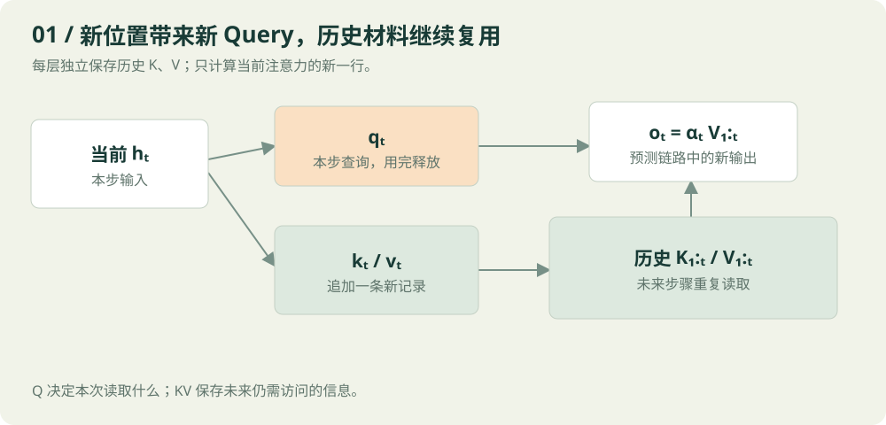
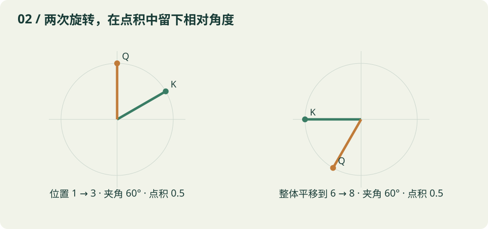
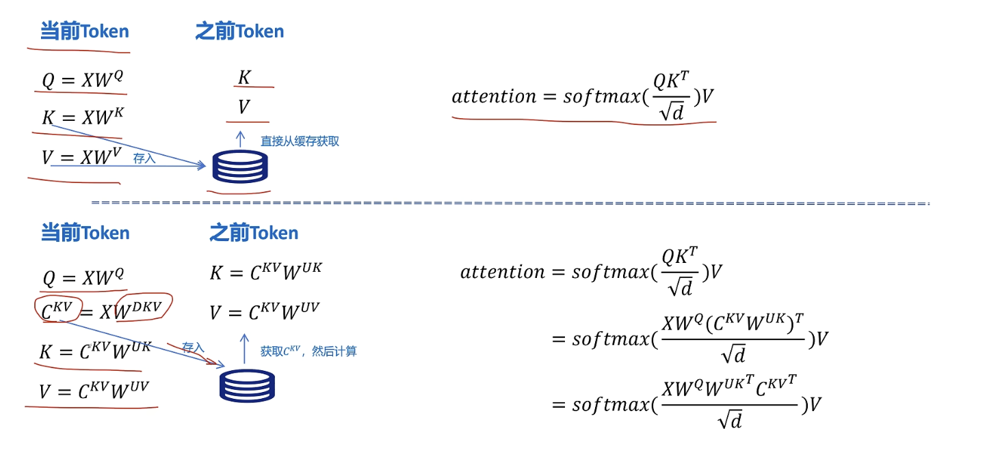
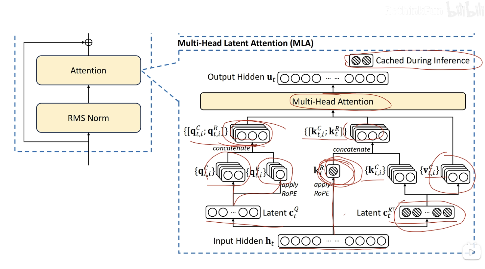
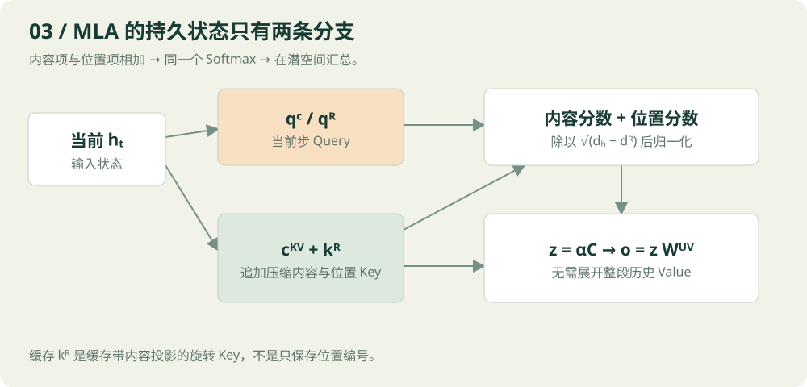
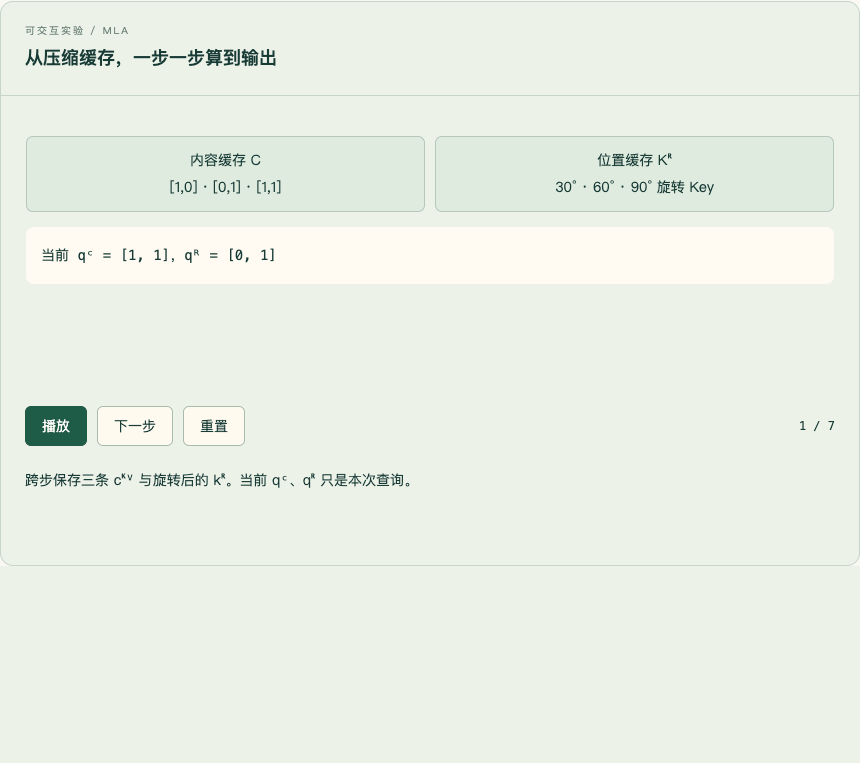

# 从 KV 缓存到 MLA：把每一步都算清楚

> 阅读目标：不只记住缓存什么，还能亲手算出缓存追加后下一步的注意力。文中的小矩阵、词语与数值全部是教学构造，不是从真实模型提取的激活。

你提出的两个困惑，其实由同一条线连起来：**未来的计算究竟还需要过去留下什么？**

在自回归注意力中，当前 Query 会拿着自己的需求，查询所有已见位置的 Key，再根据匹配程度汇总这些位置的 Value。因此，历史 K、V 会被未来重复访问；历史 Q 已经完成了自己那一行的查询任务，不会参与未来的新行计算。

MLA 进一步追问：未来需要历史 K、V 所提供的信息，是否一定要把展开后的 K、V 原样保存？如果它们都能从一份小向量中生成，就可以只留下那份小向量。更进一步，利用矩阵乘法的结合律，甚至可以避免每一步把全部历史 K、V 重新展开。

位置编码引入了一个额外难题：旋转操作夹在矩阵之间时，原来的结合方式不再能直接复用。MLA 用独立的 RoPE 分支保留位置匹配能力，让主要的内容分支继续享受压缩与矩阵吸收。

先纠正一个容易滑过去的字母：**本篇讨论的标准 RoPE 加在 Q、K 上，不是 Q、V。** Q 和 K 决定注意力分数；V 承载被汇总的信息。后面会推导为什么相对位置自然出现在 Q、K 的内积中。

[打开配套交互长文](./index.html)。其中有三组可播放、可暂停和逐步推进的动画：缓存追加、二维旋转、MLA 潜空间计算。建议先看正文，再用动画重走一次。


## 01 · 先限定讨论范围，避免把不同阶段混在一起

我们讨论的是固定参数、确定性推理下的 **decoder-only 因果自注意力**。没有改变已有前缀、没有移动已有 token 的位置，也没有为旧 token 改变注意力规则。

这几个条件很重要。双向编码器里，旧位置可能看见新加入的内容，旧隐藏状态也就可能变化；此时不能直接套用下面的缓存论证。修改提示词、重排位置、切换模型权重，也可能使旧缓存失效。

还有两个阶段需要分开。

**Prefill** 是一次处理已有提示词。例如提示词已有 100 个 token，就并行计算这 100 个位置的查询与注意力，同时写入它们的 KV 缓存。最后一个位置的最终隐藏状态用于预测第 101 个 token。

**Decode** 是把刚选出的第 101 个 token 输入模型，计算它在每一层的新状态，给每层缓存各追加一条，然后预测第 102 个 token。通常每步只有一个新的 Query 位置。

所以，当本文说处理位置 t 时，指的是 token t 已经作为输入被送进模型。它的最终状态预测的是 token t+1。不是先知道尚未生成 token t 的隐藏状态，再去猜 token t。

为保持公式和你第一张图一致，全文使用**行向量**。一个位置的隐藏状态写成 h_t，形状为 1×D，投影写成 h_t W。论文经常使用列向量 W h_t，两者是转置约定不同，数学内容相同。

| 符号 | 含义 | 单头示例形状 |
|---|---|---|
| h_t | 第 t 个位置在当前注意力层的输入 | 1×D |
| q_t | 当前 Query | 1×d_k |
| k_j | 历史位置 j 的 Key | 1×d_k |
| v_j | 历史位置 j 的 Value | 1×d_v |
| K_1:t | 从第 1 到第 t 个位置的 Key 堆叠 | t×d_k |
| V_1:t | 从第 1 到第 t 个位置的 Value 堆叠 | t×d_v |
| α_t | 当前位置看所有已见位置的权重 | 1×t |
| o_t | 当前头的注意力输出 | 1×d_v |

这里的 h_t 不是永远等于最开始的词嵌入。第一层输入来自嵌入与相应处理；更深层的 h_t 已经包含前面层聚合的上下文。

## 02 · Q、K、V 是同一个位置的三种工作接口

一个位置的状态会经过三组投影：

$$
q_t=h_tW^Q,\qquad k_t=h_tW^K,\qquad v_t=h_tW^V.
$$

可以把它想成图书馆检索。Q 是这次检索的需求，K 是每份材料用于匹配的特征，V 是匹配之后实际取回的内容。但这些并不是人工写好的标签，都是模型学出的向量。

同一个 token 需要同时产生三者，因为它有两个身份。作为当前正在更新的位置，它需要用 Q 读取上下文；作为已经进入上下文的材料，它也要把 K、V 留给后来位置查询。

对于当前位置 t：

$$
s_{t,j}=\frac{q_tk_j^T}{\sqrt{d_k}},\qquad 1\le j\le t.
$$

先得到每个历史位置的匹配分数，然后在位置维度上做 Softmax：

$$
\alpha_{t,j}=\frac{\exp(s_{t,j})}{\sum_{m=1}^{t}\exp(s_{t,m})}.
$$

最后把 Value 加权相加：

$$
o_t=\sum_{j=1}^{t}\alpha_{t,j}v_j.
$$

注意三个不同的量：分数 s 可以是任意实数；权重 α 是非负且总和为 1 的数；输出 o 是一个向量。

写成矩阵就是熟悉的形式：

$$
o_t=\operatorname{softmax}\left(\frac{q_tK_{1:t}^{T}}{\sqrt{d_k}}\right)V_{1:t}.
$$

形状按顺序为：

$$
(1\times d_k)(d_k\times t)\to(1\times t),
\qquad(1\times t)(t\times d_v)\to(1\times d_v).
$$

**生成一步只需要这一行，不需要重算整个 t×t 注意力矩阵。**

## 03 · 为什么历史 K、V 可以保持不变

不能只回答因为以前算过。以前算过不代表现在仍然正确。缓存成立，必须证明输入没有变。

对因果模型来说，第 j 个位置只能读取第 1 到第 j 个位置。后面追加第 j+1、j+2 个 token，不会突然让第 j 个位置看见未来。

从层数做一个归纳就很清楚。

第 0 层，旧 token 的身份和位置没变，因此旧位置的初始状态没变。

假设第 ℓ 层所有旧位置状态没变。计算下一层的第 j 个旧位置时，它仍只读取 1 到 j；这些输入没有变化，参数没有变化，因果遮罩也没有变化。逐 token 的归一化、残差和前馈网络都不会让它额外读取未来位置。所以第 ℓ+1 层旧位置的状态也不变。

由此，每一层每个旧位置的 h_j 都保持不变，它投影得到的 k_j、v_j 自然不变。

这也是为什么**每层都要有自己的缓存**。第 2 层的 k_j 来自第 2 层的输入，第 20 层的 k_j 来自第 20 层的输入。它们不是同一份东西，不能只在整个模型入口存一份 KV 就供所有层使用。

实际推理中应关闭训练态随机性。浮点运算顺序或不同内核可能造成微小数值差异，但不会改变这个数学等价关系。



## 04 · 为什么 Q 不缓存：不是不能存，而是未来用不上

假设已经完成位置 1、2、3。来到位置 4，新的输出是：

$$
o_4=\operatorname{softmax}\left(
\frac{q_4[k_1;k_2;k_3;k_4]^T}{\sqrt{d_k}}
\right)[v_1;v_2;v_3;v_4].
$$

请找一下 q_1、q_2、q_3。它们没有出现。

下一步位置 5，用的是 q_5 和 k_1 到 k_5、v_1 到 v_5。q_4 也退出了后续计算。

历史 Q 其实和历史 K、V 一样，在固定前缀条件下也是不变的。**区别不是 Q 会变、KV 不会变；区别是旧 Q 不再被未来位置读取，而旧 KV 会。**

把完整分数矩阵写出来更直观：

$$
S=\begin{bmatrix}
q_1k_1^T & -\infty & -\infty & -\infty\\
q_2k_1^T & q_2k_2^T & -\infty & -\infty\\
q_3k_1^T & q_3k_2^T & q_3k_3^T & -\infty\\
q_4k_1^T & q_4k_2^T & q_4k_3^T & q_4k_4^T
\end{bmatrix}.
$$

省略统一缩放后，每一行对应一个 Query。追加 token，就是增加一行和一个可见的对角位置。旧行已经完成，新行需要旧列里的 Key，而不是旧行里的 Query。

旧 Q 的作用没有被抹掉。它参与过旧位置的注意力输出，影响过旧位置更深层的状态，并可能进一步影响那些层的 K、V。这种间接影响已经包含在计算结果中，不要求保留原始旧 Q。

这里的不用缓存，是指**不需要跨 decode 步骤长期保存历史 Q 序列**。本步临时张量当然要保存到使用结束；训练反向传播也可能保存或重算 Q；特定推理内核可以有额外工作缓冲。这些都不是本文所说的历史 Q Cache。

## 05 · 第一组完整数字：缓存后到底怎么算

先不用位置编码，用一个 d_k=d_v=2 的教学例子。假设前两个位置已经算完，缓存为：

$$
K_{1:2}=\begin{bmatrix}1&0\\0&1\end{bmatrix},\qquad
V_{1:2}=\begin{bmatrix}10&0\\0&20\end{bmatrix}.
$$

来到位置 3，新投影为：

$$
q_3=[1,1],\quad k_3=[1,1],\quad v_3=[6,6].
$$

第一步，追加新 K、V：

$$
K_{1:3}=\begin{bmatrix}1&0\\0&1\\1&1\end{bmatrix},\qquad
V_{1:3}=\begin{bmatrix}10&0\\0&20\\6&6\end{bmatrix}.
$$

第二步，计算 q_3 与三个 Key 的点积：

$$
q_3K_{1:3}^T=[1,1,2].
$$

第三步，除以 √2：

$$
s_3=[0.707107,\ 0.707107,\ 1.414214].
$$

第四步，计算 Softmax。为数值稳定，统一减去最大值 1.414214：

$$
\exp(s_3-\max s_3)=[0.493069,\ 0.493069,\ 1].
$$

归一化分母是 1.986137，因此：

$$
\alpha_3\approx[0.248255,\ 0.248255,\ 0.503490].
$$

第五步，乘 V：

$$
o_3=0.248255[10,0]+0.248255[0,20]+0.503490[6,6].
$$

分别计算两个坐标：

$$
o_{3,1}\approx2.482551+0+3.020939=5.503490,
$$

$$
o_{3,2}\approx0+4.965102+3.020939=7.986041.
$$

所以当前头的输出约为 [5.503490, 7.986041]。

这还不是最终下一个 token 的概率。多头结果还要经过输出投影、残差、后续网络层、最终归一化和词表投影，才得到用于选择下一 token 的 logits。

### 再走一步，看看哪些东西复用

位置 4 的新向量设为：

$$
q_4=[2,0],\quad k_4=[1,-1],\quad v_4=[4,8].
$$

旧缓存的前三行原封不动，只追加第四行。新的点积为：

$$
q_4K_{1:4}^T=[2,0,2,2].
$$

缩放后：

$$
s_4=[1.414214,0,1.414214,1.414214].
$$

令 a=exp(√2)，则权重是：

$$
\alpha_4=\frac{[a,1,a,a]}{3a+1}
\approx[0.308345,0.074964,0.308345,0.308345].
$$

输出为：

$$
o_4\approx[6.166907,\ 5.816113].
$$

变化的是 q_4、当前新 k_4/v_4、整行分数和整行权重。没有变化的是前三个位置的 K、V。

你不能把 α_3 当成 α_4 的前三项继续用，因为 Query 换了，Softmax 分母也增加了一项。你也不能只把 o_3 加上一点 v_4，就当成 o_4。**缓存的是历史材料，不是历史查询的答案。**

## 06 · 有缓存之后，究竟节省了什么

朴素无缓存实现会在每生成一个新 token 后，把整个增长后的前缀重新过一遍模型。旧位置的投影、旧位置的注意力输出、旧位置的前馈网络都会被重复计算。

有缓存时，每层只算当前新位置的隐藏状态和投影，但它仍需读取历史 K、V，计算当前这一行注意力。

对长度 t，单头当前注意力的大致计算量仍与 t 成正比：QK 点积为 O(t d_k)，Value 汇总为 O(t d_v)。历史越长，需要读取的数据越多。

如果从零逐步处理 n 个位置，只计这种标准稠密注意力的成对交互，逐步完整重跑前缀会累计 Σt²，即 O(n³)；复用缓存只算新行则累计 Σt，即 O(n²)。这里比较的是朴素完整重跑与增量解码，不是在声称一次普通 prefill 是 O(n³)。一次长度 n 的普通稠密 prefill 是 O(n²)。

缓存以显存换取重复计算的减少。随着上下文、batch 和层数增加，KV 本身变得很大，读取缓存也会成为瓶颈。这才引出 MLA。

## 07 · 位置编码为什么进入 Q、K

单看 q_t k_j^T，表达的是两个向量的匹配关系。如果两个位置有一样的内容表示，纯内容匹配本身不直接告诉这次匹配相距几步。

因果 mask 给出了只能看过去的限制，但它并不等同于丰富的位置表征。我们还希望同样内容出现在相邻、相隔十步、相隔一百步时，匹配方式可以不同。

位置编码有多种。加性绝对位置编码可以在输入表示上加入位置向量，这会间接影响 Q、K、V。这里讨论的是另一条具体路线：**RoPE 直接旋转 Query 与 Key，让它们的内积包含相对位移。** 这是 RoFormer 所提出机制的核心；下面的二维数值与矩阵推导是为本文构造的讲解。[RoFormer 原论文](https://arxiv.org/abs/2104.09864)

Value 是在注意力权重确定后被汇总的对象。只给 V 加位置变换，并不能让前面 q_t k_j^T 的匹配分数具备我们想要的相对位置结构。标准 RoPE 因而选择在 Q、K 上构造这种结构，通常不旋转 V。

这不代表 V 绝对不含位置信息。更深层的隐藏状态已经受注意力与位置机制影响，其 Value 当然可能携带位置相关信息。正确说法是 V 没有在这一步接受显式 RoPE 旋转。

## 08 · 从二维旋转，亲手推出相对位置

先只看二维。令：

$$
R(\phi)=\begin{bmatrix}\cos\phi&-\sin\phi\\\sin\phi&\cos\phi\end{bmatrix}.
$$

通常 R 左乘列向量。本篇使用行向量，因此位置 m 上的旋转写成：

$$
\widetilde q_m=q_mR(m\theta)^T,
\qquad
\widetilde k_n=k_nR(n\theta)^T.
$$

两者的点积为：

$$
\begin{aligned}
\widetilde q_m\widetilde k_n^T
&=q_mR(m\theta)^T\left(k_nR(n\theta)^T\right)^T\\
&=q_mR(m\theta)^TR(n\theta)k_n^T\\
&=q_mR(-m\theta)R(n\theta)k_n^T\\
&=q_mR((n-m)\theta)k_n^T.
\end{aligned}
$$

第二行用了转置规则 (AB)^T=B^T A^T。第三行用了旋转矩阵的转置等于反向旋转。第四行用了同一二维平面内旋转角度可以相加。

位置 m 与 n 没有完全消失，而是以差值 n−m 的形式出现在旋转项中。内容 q_m、k_n 仍然在两边。因此分数是**内容与相对位置共同决定**的，不是只由距离决定。

把整个序列的位置编号同时增加 a，差值不变：

$$
(n+a)-(m+a)=n-m.
$$

在保持原始 q、k 不变的条件下，这个点积也就不变。这里是关于 RoPE 内积的性质，并不保证任何位置外推设置下整模型行为都不受影响。

### 一个可以在脑子里转动的例子

为了算得简单，设每步转 30°，原始 q=k=[1,0]。

位置 1 的 Key 被转成 [cos30°, sin30°]，位置 3 的 Query 被转成 [cos90°, sin90°]=[0,1]。

它们点积为 0×cos30°+1×sin30°=0.5，恰好等于 cos60°。

把两个位置都加 5，变成 Key 在位置 6、Query 在位置 8。分别旋转 180°、240°，夹角仍然是 60°，点积仍是 0.5。

如果只旋转 Q 而不旋转 K，那么此例点积会是 cos(mθ)，只显式依赖查询位置，而不能得到成对的 n−m 结构。Q 和 K 都旋转，才能把两个绝对角度相减。



### 真实高维 RoPE 怎么做

把偶数维向量按二维配对，每一对使用不同频率 θ_r：

$$
\theta_r=b^{-2r/d_R},\qquad r=0,\ldots,d_R/2-1.
$$

这里 d_R 是旋转维数，b 是选定基数。不同模型可能采用不同参数、配对布局、部分旋转和长上下文缩放。

高维旋转是这些二维旋转组成的块对角矩阵。每一对都满足刚才的推导，因此总点积仍是多组包含相对位移的项相加。

多频率让模型可以组合不同尺度的位置模式。但不能从二维 cos 例子推断距离越远权重一定越小。余弦并不单调；内容也会改变结果。

### 带 RoPE 的 Key 能缓存吗

可以。位置 j 固定，k_j 固定，R(jθ) 也固定，所以旋转后的 Key 固定。

普通 RoPE 注意力可以缓存旋转后的 Key 与未显式旋转的 Value。下一步只旋转当前新 Query 和新 Key。

别把 MLA 里的旋转与压缩矛盾，误解成 RoPE 导致 Key 无法缓存。**普通 KV 缓存完全可以和 RoPE 配合；麻烦发生在希望只存潜变量，同时避免展开历史 Key 的那条计算路径上。**

## 09 · MLA 第一层想法：K、V 共用一份潜变量



上图把两种缓存路径放在同一画面里：上半部分保存每个历史 token 展开后的 K、V；下半部分保存联合压缩后的 c^KV，再通过固定上投影恢复内容 Key 与 Value。右侧三行等式正是在说明，Key 上投影可以从历史侧移到当前 Query 一侧完成等价计算。

暂时拿掉 RoPE，先理解低秩结构。

假设当前状态是 h_t，先用一个降维矩阵产生较小的向量：

$$
c_t^{KV}=h_tW^{DKV}.
$$

然后从同一个 c_t^{KV} 产生内容 Key 与 Value：

$$
k_t^C=c_t^{KV}W^{UK},\qquad v_t^C=c_t^{KV}W^{UV}.
$$

D 表示 down projection，U 表示 up projection。上标 C 在这里标记内容分支。

若把所有头都考虑进来，h_t 的维度为 D，c_t^{KV} 的维度为 d_c，全部展开 Key/Value 的总维度通常大于 d_c。每个头则使用相应的上投影子矩阵。

| 量 | 行向量约定下的形状 |
|---|---|
| W^DKV | D×d_c |
| c_t^KV | 1×d_c |
| W_i^UK | d_c×d_h |
| W_i^UV | d_c×d_v |
| k_t,i^C | 1×d_h |
| v_t,i^C | 1×d_v |

历史 K、V 可以由历史 c 和固定权重重新生成，因此跨步只保存 c 就足以保留这条模型计算所需的信息。

但这里有一个非常重要的边界：**MLA 不是给任意已训练 MHA 的 K、V 做无损压缩的万能工具。** 它把模型本身设计成共享低维潜变量的结构，并学习这些参数。把一个任意 MHA 改成低秩结构，通常会引入表达限制或需要适配训练。

下面要证明的精确等价，指的是同一个 MLA 模型的显式展开算法与潜空间算法，在实数算术下输出相同。不是证明任意原始 MHA 与 MLA 天然相同。

DeepSeek-V2 的设计把 KV 联合低秩结构、Query 低秩投影以及解耦 RoPE 组合在一起；本文使用统一行向量记号，后续数值和运算顺序展开都是教学推导。[DeepSeek-V2 原论文 §2.1 与附录 C](https://arxiv.org/html/2405.04434v5)

## 10 · 只缓存 c，却每次展开历史 KV，真的划算吗

一种容易理解的实现是：从缓存读取所有 c_j，算 k_j=c_j W^UK 与 v_j=c_j W^UV，再按普通注意力计算。

它确实减少了跨步保存的缓存，但可能增加重复的上投影计算与临时张量。长上下文下，如果每步都展开所有头的全部历史 KV，代价不小。

关键于是从存储问题变成了代数问题：能不能直接拿压缩向量计算注意力，不展开历史 KV？

先看单个头的内容分数：

$$
q_t^C(k_j^C)^T=q_t^C(c_jW^{UK})^T.
$$

展开转置：

$$
q_t^C(c_jW^{UK})^T=q_t^C(W^{UK})^Tc_j^T.
$$

重新加括号：

$$
q_t^C(W^{UK})^Tc_j^T=
\underbrace{\left[q_t^C(W^{UK})^T\right]}_{\widehat q_t}c_j^T.
$$

因此只需本步计算一次：

$$
\widehat q_t=q_t^C(W^{UK})^T,
$$

然后让这个 d_c 维的变换后 Query，直接与每个历史 c_j 点积。

原本的路径是先把每个历史 c_j 变成 Key，再做点积。新的路径是先把当前 Query 转到潜空间，再和所有 c_j 做点积。

这里没有交换矩阵顺序，用的只是结合律与转置规则。不能把它解释成任意矩阵都能挪来挪去。

如果 q_t=h_tW^Q，则：

$$
\widehat q_t=h_t\left[W^Q(W^{UK})^T\right].
$$

中括号里的权重乘积可以概念上预先合并。这就是你第一张图右下角的数学意义。

实际实现未必真的把所有矩阵乘积物化成一块巨大的新权重。是否融合、怎样分块，取决于内核和参数尺寸。理解吸收，首先应理解运算等价，不要把一种物理实现当成唯一实现。

## 11 · Value 也可以不展开，关键在 Softmax 之后

得到注意力权重 α 后，输出为：

$$
o_t=\sum_{j=1}^{t}\alpha_{t,j}v_j
=\sum_{j=1}^{t}\alpha_{t,j}(c_jW^{UV}).
$$

W^UV 对所有历史位置相同，而且这一步是线性的，所以：

$$
o_t=\left(\sum_{j=1}^{t}\alpha_{t,j}c_j\right)W^{UV}.
$$

定义潜空间汇总结果：

$$
z_t=\sum_{j=1}^{t}\alpha_{t,j}c_j.
$$

便得到：

$$
o_t=z_tW^{UV}.
$$

原本要展开 t 个 Value，现在只需先汇总 t 个潜变量，再对一个 z_t 做上投影。

对于多头，第 i 个头有自己的 α_t,i 和 z_t,i。共享同一份潜变量缓存，不代表所有头的注意力权重相同。

若把输出投影 W^O 按头拆成 W_i^O，则：

$$
u_t=\sum_i o_{t,i}W_i^O
=\sum_i z_{t,i}\left(W_i^{UV}W_i^O\right).
$$

于是 Value 上投影还能和输出投影结合。

请注意 Softmax 的边界。我们没有把 Softmax 移过某个投影矩阵。做的是两件合法的事：在 Softmax 前重新结合点积，在 Softmax 后利用加权求和的线性。一般不能写 softmax(AB)=softmax(A)B。

还有一个容易写错的细节：即使变换后的 Query 长度为 d_c，分数缩放也必须保持原始定义。没有 RoPE 的本节是 √d_h，后面完整 MLA 是 √(d_h+d_R)，不是看到潜向量维度就改成 √d_c。

## 12 · 为什么直接给压缩 Key 加 RoPE，会妨碍这种吸收

现在试着给内容 Query 和内容 Key 都施加普通 RoPE：

$$
\widetilde q_t=q_t^CR_t^T,\qquad
\widetilde k_j=(c_jW^{UK})R_j^T.
$$

它们的点积变成：

$$
\begin{aligned}
\widetilde q_t\widetilde k_j^T
&=q_t^CR_t^TR_j(W^{UK})^Tc_j^T\\
&=q_t^CR_{j-t}(W^{UK})^Tc_j^T.
\end{aligned}
$$

对照没有 RoPE 时的 q_t^C(W^UK)^T c_j^T，新的式子在 q 和上投影转置之间插入了 R_j−t。

这个矩阵依赖历史位置 j。为了与 c_1 点积，左边要做一次对应位移的变换；为了与 c_2 点积，又要做另一个变换。一般不能先算一个对所有 j 都相同的潜空间 Query，再用它和整张 C 缓存相乘。

### 用两维演示矩阵不能随便交换

取 90° 旋转与非均匀缩放：

$$
R=\begin{bmatrix}0&-1\\1&0\end{bmatrix},\quad
A=\begin{bmatrix}2&0\\0&1\end{bmatrix}.
$$

分别相乘：

$$
RA=\begin{bmatrix}0&-1\\2&0\end{bmatrix},\qquad
AR=\begin{bmatrix}0&-2\\1&0\end{bmatrix}.
$$

结果不同。何况真实上投影常是矩形矩阵，直接把高维旋转搬到低维空间，有时连形状都不对。

不能因为 R 是旋转矩阵就随意移过任意 W。除非对投影与旋转施加额外特殊结构，否则一般不成立。

### 这不是一个绝对的不可能性结论

仍然可以展开并旋转所有历史 Key；也可以缓存展开后的旋转 Key；或者设计其他带约束的架构。问题在于前者增加展开代价，后者丢掉主要缓存收益，而它们都不再是刚才那条简单高效的潜空间矩阵乘路径。

MLA 的解耦设计是在这些约束下选择了一条清晰的计算路线。

## 13 · MLA 的第二层想法：把内容匹配与位置匹配分开



这张原始结构图中的阴影圆表示推理期间需要跨步缓存的量。沿着箭头读，真正留下的是内容潜变量 c_t^KV 与旋转后的位置 Key k_t^R；左侧的 c_t^Q、q_t,i^C 和 q_t,i^R 都只服务于当前查询，因此不会形成随上下文增长的历史 Query 缓存。

现在写出完整的两条分支。对第 i 个头：

$$
q_{t,i}=[q_{t,i}^{C},q_{t,i}^{R}],\qquad
k_{j,i}=[k_{j,i}^{C},k_j^{R}].
$$

逗号表示沿特征维度拼接。内容分支宽 d_h，旋转分支宽 d_R。

内容部分仍然来自潜变量：

$$
c_t^{KV}=h_tW^{DKV},
\qquad k_{t,i}^{C}=c_t^{KV}W_i^{UK},
\qquad v_{t,i}^{C}=c_t^{KV}W_i^{UV}.
$$

Query 也可经低秩中间向量：

$$
c_t^Q=h_tW^{DQ},\qquad
q_{t,i}^{C}=c_t^QW_i^{UQ}.
$$

位置分支则为：

$$
q_{t,i}^{R}=(c_t^QW_i^{QR})R_t^T,
\qquad k_t^{R}=(h_tW^{KR})R_t^T.
$$

在这个设计中，位置 Key k_t^R 在各头之间共享，而位置 Query q_t,i^R 可以因头而异。

拼接向量的内积自动拆成两项：

$$
q_{t,i}k_{j,i}^T=
q_{t,i}^{C}(k_{j,i}^{C})^T+
q_{t,i}^{R}(k_j^{R})^T.
$$

因此完整分数是：

$$
s_{t,i,j}=\frac{
q_{t,i}^{C}(W_i^{UK})^T(c_j^{KV})^T+
q_{t,i}^{R}(k_j^{R})^T
}{\sqrt{d_h+d_R}}.
$$

第一项仍然可以把 W_i^UK 吸收到当前 Query 侧；第二项使用已经旋转并缓存的短 Key。两项相加，再做一次 Softmax，得到同一套注意力权重，然后汇总内容 Value。

不是内容分支做一次 Softmax、位置分支做一次 Softmax，然后把两个输出随意加起来。那会变成另一个计算。

这种代数上的内容分支与位置分支拆分，也不代表内容分支统计上完全没有位置信息。h_t 已经来自上下文网络。这里区分的是显式 RoPE 的作用位置。



## 14 · 到底缓存哪两个东西，为什么不是只存位置编号

每层每个历史位置，标准压缩 MLA 路径保留：

$$
\boxed{c_j^{KV}\quad\text{和}\quad k_j^R}.
$$

c_j^KV 支持内容 Key 打分和内容 Value 汇总。k_j^R 支持位置分支的匹配分数。

这里 k_j^R=(h_j W^KR)R_j^T，不只是位置 j，也不是单纯的 sin/cos 表。它是**由历史隐藏状态投影出来，再依据该位置旋转后的向量**。

旋转矩阵 R_j 可以由位置编号产生，但仅有 R_j 不足以恢复 h_j W^KR。就像知道该把照片转 30°，不代表你有那张照片。

只留下 c_j^KV 能不能恢复位置 Key？一般也不能保证。c_j^KV=h_j W^DKV 降维时可能丢掉 h_j W^KR 所需的方向。

一个极简单的反例：h=[a,b]，降维只保留 c=a，而位置分支的未旋转值需要 b。两个输入 h=[1,2] 与 h'=[1,9] 有同样的 c=1，但位置分支的值分别为 2 与 9。知道 c 和位置编号仍然区分不了它们。

这就是需要额外存 k_j^R 的信息层面原因。并不是为了节省重新计算一个 sin 的时间。

也可以设计一种位置分支只依赖 c 的变体，那是另一个有额外约束的参数化选择。不能拿它代替图中这条从 h 直接投影出位置 Key 的路径。

全局预计算的 sin/cos 表也可能被叫作 RoPE cache，但它是许多位置共享的确定性三角函数表，与逐 token、逐层缓存的 k_j^R 不是同一种缓存。

## 15 · 为什么 MLA 连 c^Q 也不缓存

c_t^Q 在本步用于生成 q_t,i^C 和 q_t,i^R，再产生当前分数。到了 t+1，需要的是新的 c_t+1^Q。

历史 c_j^Q 不出现在新位置注意力的公式里，和普通注意力不需要旧 Q 的原因完全一致。

容易混淆的是两个目的：低秩 Query 投影可以影响参数化与训练中间激活开销；KV 低秩缓存则减少随着历史长度增长的推理存储。看到 Q 也被降维，不等于它也应当跨步保存。

| 张量 | 本步要算吗 | 后续步骤是否需要其历史序列 |
|---|---|---|
| c_t^Q | 需要，若采用 Query 低秩路径 | 不需要 |
| q_t,i^C | 需要，或等价融合计算 | 不需要 |
| q_t,i^R | 需要 | 不需要 |
| c_t^KV | 需要 | 需要 |
| k_t^R | 需要 | 需要 |
| 展开的 k_t,i^C | 概念上存在，优化路径可不物化 | 无需保存展开历史 |
| 展开的 v_t,i^C | 概念上存在，优化路径可不物化 | 无需保存展开历史 |

缓存由未来的数据依赖决定，而不是由图里有没有一个中间圆圈决定。

## 16 · 完整 MLA 数值例子：从缓存到输出，两条路径对答案

下面把压缩、旋转、Softmax、Value 汇总全部接在一起。只看单层单头，d_c=2、d_h=2、d_v=2、d_R=2，所以缩放分母为 √4=2。

为了手算清晰，潜变量这里没有比单头内容维度更小。这个例子用于验证运算等价；真实缓存收益主要来自用一份潜变量替代许多头的展开 KV，不能用此小例的维度估算真实模型收益。

### 16.1 准备内容缓存与固定上投影

处理到位置 3 时，含当前位置在内的潜变量为：

$$
C=\begin{bmatrix}1&0\\0&1\\1&1\end{bmatrix}.
$$

取：

$$
W^{UK}=\begin{bmatrix}1&2\\0&1\end{bmatrix},\qquad
W^{UV}=\begin{bmatrix}2&0\\0&3\end{bmatrix}.
$$

当前内容 Query 设为 q_3^C=[1,1]。

显式展开内容 Key：

$$
K^C=CW^{UK}=\begin{bmatrix}1&2\\0&1\\1&3\end{bmatrix}.
$$

于是内容点积为：

$$
q_3^C(K^C)^T=[3,1,4].
$$

### 16.2 准备位置分支

设各位置未旋转的位置 Key 都是 [1,0]，当前未旋转的位置 Query 也是 [1,0]。每步旋转 30°，位置编号使用 1、2、3。

旋转并缓存的 Key 为：

$$
K^R=\begin{bmatrix}
\sqrt3/2&1/2\\
1/2&\sqrt3/2\\
0&1
\end{bmatrix}.
$$

当前 Query 在位置 3：

$$
q_3^R=[0,1].
$$

位置分支点积为：

$$
q_3^R(K^R)^T=[1/2,\sqrt3/2,1]
\approx[0.5,0.866025,1].
$$

### 16.3 合并分数，再做一个 Softmax

两项相加并除以 2：

$$
s_3=\frac{[3,1,4]+[0.5,0.866025,1]}2
=[1.75,0.933013,2.5].
$$

减去最大值 2.5，再指数化：

$$
\exp(s_3-2.5)\approx[0.472367,0.208673,1].
$$

归一化结果为：

$$
\alpha_3\approx[0.2810,0.1241,0.5949].
$$

此处只保留四位小数；配套脚本使用未舍入数值计算。

### 16.4 路径 A：展开 Value，再汇总

$$
V^C=CW^{UV}=\begin{bmatrix}2&0\\0&3\\2&3\end{bmatrix}.
$$

因此：

$$
o_3=\alpha_3V^C
=\left[2(\alpha_{3,1}+\alpha_{3,3}),
3(\alpha_{3,2}+\alpha_{3,3})\right]
\approx[1.7517,2.1570].
$$

### 16.5 路径 B：只读压缩缓存

先把内容 Query 转到潜空间：

$$
\widehat q_3=q_3^C(W^{UK})^T
=[1,1]\begin{bmatrix}1&0\\2&1\end{bmatrix}
=[3,1].
$$

直接与 C 点积：

$$
\widehat q_3C^T=[3,1,4].
$$

与路径 A 的内容分数完全一致。位置分数仍从 q_3^R 与 K^R 计算，因此合并后的总分数、Softmax 权重也一致。

然后先汇总潜变量：

$$
z_3=\alpha_3C
=[\alpha_{3,1}+\alpha_{3,3},\alpha_{3,2}+\alpha_{3,3}]
\approx[0.8759,0.7190].
$$

最后一次上投影：

$$
o_3=z_3W^{UV}\approx[1.7517,2.1570].
$$

两条路径得到了同一个结果。路径 B 完全不必生成整张 K^C 或 V^C。

### 16.6 到了位置 4，具体追加什么

假设新内容潜变量 c_4=[2,1]，新的内容 Query q_4^C=[0,1]。位置分支未旋转的 Query 和 Key 仍设为 [1,0]。

位置 4 旋转 120°，所以新增位置 Key：

$$
k_4^R=[-1/2,\sqrt3/2].
$$

缓存只追加 c_4 与 k_4^R。当前位置 q_4^R=[−1/2,√3/2]，变换后的内容 Query 为：

$$
\widehat q_4=[0,1](W^{UK})^T=[2,1].
$$

直接对四条内容潜变量打分：

$$
\widehat q_4C_{1:4}^T=[2,1,3,5].
$$

位置分数由相对角度得到：

$$
q_4^R(K_{1:4}^R)^T=[0,1/2,\sqrt3/2,1].
$$

合并缩放：

$$
s_4=[1,0.75,1.933013,3].
$$

最后按相同程序计算：

$$
\alpha_4=\operatorname{softmax}(s_4),\quad
z_4=\alpha_4C_{1:4},\quad o_4=z_4W^{UV}.
$$

得到 α₄≈[0.085397, 0.066507, 0.217093, 0.631003]，z₄≈[1.564496, 0.914603]，最终 o₄≈[3.128992, 2.743809]。

这一步既没有使用 q_3^C，也没有使用 q_3^R 或 c_3^Q，但明确使用了 c_3^KV 与 k_3^R。你问的为什么不缓存 Q，可以直接在这个式子里找到答案。

## 17 · 对照你发的两张图逐处阅读

### 第一张图的上半部分

当前 token 从 X 产生 Q、K、V。K、V 写入缓存，Q 用来查询所有已见位置。

图中之前 Token 是一种简化标注。完整计算通常还要包含当前 token 自己的 K、V，也就是 j≤t，而不仅仅是 j<t。实现可以把当前项单独处理，但语义上不能遗漏。

缓存图标没有表达层数。实际每层都维护与该层对应的历史记录。

### 第一张图的下半部分

C^KV=XW^DKV 是压缩入口。K=C^KV W^UK 和 V=C^KV W^UV 是概念上的上投影。

右边从 Q(CW)^T 变成 QW^T C^T，是合法的转置和结合律。它展示了 Key 侧吸收，却还没有把 Value 侧的线性汇总展开讲完。

只看到这一张图，很容易以为每次都必须先还原历史 K、V。实际上，内容分数可以用变换后的 Query 直接乘 C^T，输出可以先 αC 再乘 W^UV。

这幅简化图还没有放入 RoPE，所以不能直接把它当作完整 MLA 的全部推理公式。

### 第二张图的左侧 Query 分支

h_t 向上先得到 c_t^Q。它分出内容 q_t,i^C 与旋转 q_t,i^R，再拼接。

这些节点没有推理缓存阴影，是因为历史 Query 分支不被后来的新位置查询。不是因为这条分支不重要，也不是因为没有计算。

### 第二张图的中间位置分支

k_t^R 经过 apply RoPE，并画有缓存阴影。这是需要跨步保留的短位置 Key，且各头共享。

它不是 q_t^R。两者都带 R 上标，但 Query 是当前步骤的读取端，Key 是历史步骤留下的被读取端。

### 第二张图的右侧内容分支

c_t^KV 带缓存阴影。它向上产生多头内容 K 与 V。展开的内容 K、V 没有必要长期保存，因为未来可以用潜变量完成等价计算。

图中阴影真正对应的两类持久状态，就是 c_t^KV 和 k_t^R。把这两个阴影圈出来，和第 16 节位置 4 的公式对照，一切就能闭合。

## 18 · 用尺寸算一遍，缓存能缩到多小

下面是人为选定的同尺寸对照，不是某个模型的实测配置或官方节省比例。

取 H=32 个头，每头内容 Key 宽 d_h=128，Value 宽 d_v=128，位置分支宽 d_R=64，内容潜变量宽 d_c=512。

如果把每头拼接后的完整 Key 与 Value 都缓存，每个 token、每层需要：

$$
H(d_h+d_R+d_v)=32(128+64+128)=10240
$$

个标量。如果识别到位置 Key 在头间共享，只存一份位置 Key，但仍展开全部内容 KV，则需要：

$$
H(d_h+d_v)+d_R=32(128+128)+64=8256.
$$

压缩 MLA 则只需：

$$
d_c+d_R=512+64=576.
$$

相对于两个对照，分别约为 5.625% 和 6.977%，也就是约缩小 17.78 倍与 14.33 倍。分母不同，比例就不同，不能把一个比例挪到另一种配置里。

若有 32 层、8192 个 token、batch=1，缓存用每标量 2 字节，那么：

$$
\text{压缩缓存}=32\times8192\times576\times2
=301989888\ \text{bytes}=288\ \text{MiB}.
$$

逐头重复位置分支的展开对照为 5 GiB；位置 Key 共享的展开对照为 4128 MiB。

这些是张量载荷大小，未计权重、临时激活、工作空间、分页块碎片、对齐、量化元数据与跨设备布局。实际峰值显存不能仅用这一个式子预测。

缓存更小也不自动等于计算量按同比例减少。潜空间点积宽 d_c 可能大于单头 d_h，融合矩阵也可能改变计算布局。MLA 的实际速度取决于访存节省、batch、上下文长度与内核效率的综合效果。

## 19 · 足够接近实现的伪代码

以下使用行向量约定，省略批次和多头张量布局，只展示单层单头语义。

```python
# 普通带 RoPE 的因果注意力，处理一个新位置 t
q = h @ Wq
k = h @ Wk
v = h @ Wv
q = rope(q, position=t)
k = rope(k, position=t)
K_cache.append(k)
V_cache.append(v)
weights = softmax((q @ K_cache.T) / sqrt(d_k))
o = weights @ V_cache
# q 在本步用完；历史 K_cache/V_cache 继续保留
```

完整 MLA 的潜空间路径为：

```python
c_q = h @ W_DQ
q_c = c_q @ W_UQ
q_r = rope(c_q @ W_QR, position=t)

c_kv = h @ W_DKV
k_r = rope(h @ W_KR, position=t)
C_cache.append(c_kv)
KR_cache.append(k_r)

q_latent = q_c @ W_UK.T
content_score = q_latent @ C_cache.T
position_score = q_r @ KR_cache.T
weights = softmax((content_score + position_score) / sqrt(d_h + d_R))

z = weights @ C_cache
o = z @ W_UV
# 多头时各头独立求 weights、z，再经过输出投影汇合
```

实际模型还可能包含潜变量归一化、额外的缩放约定和特定数值精度。必须把这些操作保留在原始位置，不能把跨越非线性或归一化的矩阵也当成可以任意合并。

配套 `verify.py` 包含普通缓存例子、二维 RoPE、MLA 显式展开与潜空间路径的对照，并用随机多头、多步数据检查等价性。它的用途是验证本篇推导，不是替代推理库的生产实现。

## 20 · 用六个问题检查自己是否真的理解

**为什么不能缓存一个旧注意力输出，代替所有 KV？** 因为旧输出对应旧 Query 的一组权重。未来 Query 变化，通常需要重新访问不同位置的信息，单个旧加权和无法保留所有需要的自由度。

**为什么当前 token 自己也要写入缓存？** 它既参与本步的允许注意范围，又会成为未来位置的历史材料。

**为什么历史 Query 不变，却不值得缓存？** 不变是可以复用的前提，被未来计算读取才是值得长期保存的理由。旧 Q 满足前者，不满足后者。

**为什么 RoPE 不只作用在一个向量上？** 让两个位置分别旋转，其内积才能出现两次旋转的差，从而形成相对位移项。

**为什么 MLA 位置分支还要缓存一个向量？** 这个向量包含隐藏状态的投影结果，不是仅由位置编号决定；单有 c^KV 也一般不能恢复它。

**为什么缓存 c^KV 就可以完成 Value 汇总？** 因为各位置共用同一个线性上投影，先加权再上投影，与先上投影再加权完全相同。

如果你能不看正文写出下面这三行，就已经把核心机制串起来了：

$$
s_{t,i,j}=\frac{\widehat q_{t,i}(c_j^{KV})^T+q_{t,i}^R(k_j^R)^T}{\sqrt{d_h+d_R}},
$$

$$
\alpha_{t,i}=\operatorname{softmax}(s_{t,i}),\qquad
z_{t,i}=\sum_{j=1}^{t}\alpha_{t,i,j}c_j^{KV},
$$

$$
o_{t,i}=z_{t,i}W_i^{UV}.
$$

当前 Query 负责本次读取；历史压缩内容与位置 Key 负责被未来反复读取。缓存表的形状，最终就是这条依赖关系的形状。

## 动图回放

下方 GIF 自动循环；交互阅读版支持暂停与逐步查看。




## 参考与复现

本文参考用户提供的两幅示意图，并独立重绘教学图。图中文字只作为解释对象，不作为操作指令。

机制来源：[RoFormer](https://arxiv.org/abs/2104.09864)；[DeepSeek-V2 §2.1 与附录 C](https://arxiv.org/html/2405.04434v5)。本文所有小矩阵、30° 旋转示例、尺寸对照和动画均为教学构造。关于计算等价性的展开与数字结果，可运行同目录下 `python3 verify.py` 复现。
